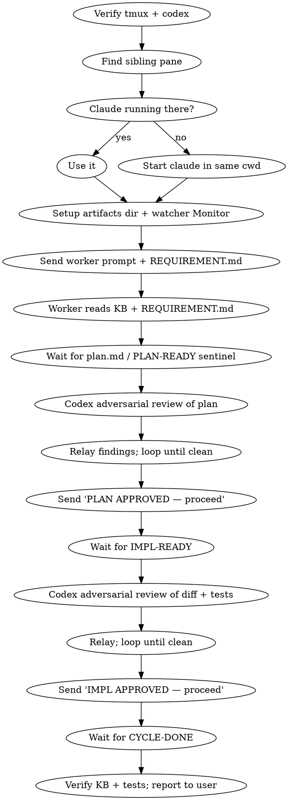

# tmux-worker-loop

## Overview
You orchestrate a **worker** Claude in a sibling tmux pane while you stay in the **driver** pane. The worker writes a plan, you have `codex:codex-rescue` adversarially review it, you relay findings, the worker implements (TDD), you review the diff/tests with codex again, then KB update + tests run.

Communication channels:
- `tmux send-keys` / `paste-buffer` — send prompts
- `tmux capture-pane` — read worker output
- Artifacts dir (`/tmp/tmux-worker-cycle-<id>/`) — plan.md, watcher script, shared files

You stay aware of worker state through a Monitor that emits an event each time the worker becomes **idle** (the "esc to interrupt" footer disappears).

## When to use
- User says "send this requirement to the next pane and monitor it" or similar.
- Long-running coding task that benefits from codex adversarial reviews at plan + diff stages.
- User wants you to watch for drift, not implement directly.

## When NOT to use
- User wants you to implement the work yourself in this pane.
- No second tmux pane available and the user does not want one created.
- Work is small enough that orchestration overhead exceeds the value.

## Workflow



## Step-by-step

### 0. Verify tmux + codex are installed
Run `command -v tmux` and the codex plugin/CLI checks. If anything is missing, **stop and read `references/install-setup.md`** for the install/verify flow before continuing. Do NOT proceed to step 1 with a degraded codex — the adversarial review gate is the whole point of this skill.

### 1. Pick the worker pane
**Documented path:** the driver Claude is already running inside tmux. If `$TMUX` is set, split the current window vertically:

```bash
me=$(tmux display-message -p '#{session_name}:#{window_index}.#{pane_index}')
sib=$(tmux list-panes -F '#{session_name}:#{window_index}.#{pane_index} #{pane_active}' \
       | awk '$2==0 {print $1; exit}')
cwd=$(tmux display-message -p '#{pane_current_path}')
if [ -z "$sib" ]; then
  tmux split-window -h -c "$cwd" -t "$me"
  sib=$(tmux list-panes -F '#{session_name}:#{window_index}.#{pane_index} #{pane_active}' \
         | awk '$2==0 {print $1; exit}')
fi
```

If `$TMUX` is unset, prefer telling the user to relaunch (`tmux new -s liebre && claude`) and re-issue. **Fallback path** (auto-create detached session + open new Terminal/iTerm window via osascript) is in `references/pane-discovery.md`.

### 2. Make sure Claude is running in the sibling
```bash
snap=$(tmux capture-pane -t "$sib" -p -S -50)
if ! grep -qE 'Opus|Sonnet|Haiku|Claude Max' <<<"$snap"; then
  tmux send-keys -t "$sib" "cd $cwd && claude" Enter
  until tmux capture-pane -t "$sib" -p -S -50 | grep -qE 'Opus|Sonnet|Haiku'; do
    sleep 2
  done
fi
```

### 2.5. Clear the worker session if it has prior conversation
If the worker pane already has Claude running with an active conversation (prior cycle's plan, codex pastes, diff), the history burns tokens and risks bleed-through. See `references/session-handling.md` for the full decision tree (fresh / mid-execution / idle-with-scrollback) and the `/clear` procedure. Quick check: when in doubt, clear — fresh context is cheap.

### 2.6. Pick the right worker model for the cycle

Cheap-by-default. The worker pane inherits whatever model `claude` launched with — usually the user's account default, which may be a 1M-context Opus tier that costs more and may even be unentitled on a particular account. Don't ride that default; pick deliberately based on the cycle's scope.

| Cycle scope | Recommended worker model |
|---|---|
| Config / wiring, KB updates, small refactors | **Sonnet 4.6** |
| Multi-file feature work with TDD | **Opus 4.6 standard (200K)** |
| Reading huge codebases or generating very long plans | **Opus 4.7 (1M)** — only when justified |

Before sending the worker prompt, glance at the worker pane's model line (the banner shows `Opus 4.7 (1M context)` etc.). If it doesn't match the table above for this cycle's scope, instruct the user to switch — or do it yourself with `tmux send-keys -t "$sib" '/model' Enter`, then guide them through the picker.

The driver pane's model is typically a separate concern and stays whatever the user picked for their interactive session — don't change it without asking.

If the worker errors with `API Error: Extra usage is required for 1M context · run /extra-usage to enable, or /model to switch to standard context`, the account doesn't have the 1M entitlement. Park the cycle, tell the user, and have them `/model` to a 200K variant before retrying — do NOT try to force the cycle through.

### 3. Set up artifacts and the idle-transition watcher
Cycle id = timestamp; dir = `/tmp/tmux-worker-cycle-<id>`. Copy `watch.sh` from this skill into the dir (so each cycle is self-contained), write the user's requirement to `REQUIREMENT.md`, then:

```
Monitor(
  command="/tmp/tmux-worker-cycle-<id>/watch.sh <sib>",
  description="worker pane <sib> idle/sentinel transitions",
  persistent=true,
  timeout_ms=3600000,
)
```

The watcher fires only on **busy → idle** transitions (no "esc to interrupt"), and surfaces any sentinel in the bottom 25 lines plus rate-limit / traceback alerts. This avoids matching prompt scrollback.

### 4. Send the worker prompt

> **Pre-dispatch budget gate.** Before sending, check the driver's session-usage indicator. See "Usage limits (HARD STOPS)" below for the table. Refuse to dispatch a new cycle if you don't have headroom. Refuse to dispatch an autonomous multi-task batch if usage ≥ 50%. This is the rule that the screenshot incident violated.

Use `worker_prompt_template.md` from this skill. Customize:
- ARTIFACTS DIR
- Service / repo to modify
- Knowledge-base path (e.g. `knowledge-base/<service>.md`)

The template instructs the worker to **read the KB first** during the plan phase and to cite KB sections in plan.md whenever a design choice is constrained or informed by them. The KB is canonical for existing decisions, persistence boundaries, error contracts, and gotchas. If the requirement contradicts the KB, the worker surfaces the contradiction in the plan instead of silently overriding. Make sure `<KB_PATH>` exists before sending — if it doesn't, point the worker at `knowledge-base/README.md` and `architecture.md` as fallbacks.

Send via:
```bash
tmux load-buffer <prompt-file>
tmux paste-buffer -p -d -t "$sib"
sleep 1
tmux send-keys -t "$sib" Enter
```
`-p` enables bracketed paste so multi-line content is preserved by Claude Code's input field.

### 5. The orchestration loop

> **Before each iteration of this loop, check your driver session usage.** If ≥ 99%, jump to the Park procedure in "Driver self-throttle at 99%" below — do NOT enter another phase. If ≥ 95%, do not start a new phase.

For each phase boundary you receive a Monitor event. When idle + sentinel `===PLAN-READY===` (or `plan.md updated`) lands:

1. `Read` plan.md.
2. **Dispatch 3 subagents in parallel to brainstorm the plan** (single message, three `Agent` tool calls — `general-purpose` or `Plan` subagent type). Distinct lenses:
   - Agent A — **requirement coverage**: does plan.md address every clause in REQUIREMENT.md? List unaddressed clauses.
   - Agent B — **alternative approaches**: propose 2 different implementation strategies the plan didn't consider; tradeoffs.
   - Agent C — **risk & failure modes**: what breaks under load, concurrency, partial failure, rollback, schema drift?
   Consolidate into a single brief.
3. Dispatch **codex:codex-rescue** with: plan.md, the requirement, the consolidated brainstorm brief, and the constraint "produce a hard adversarial review — find spec gaps, contradictions, security holes, missing test cases, hand-waving."
4. If brainstorm or codex find material issues, paste them into the worker pane prefixed with `CODEX REVIEW:`. Tell it to update plan.md and emit `===PLAN-UPDATED===`.
5. Loop until codex is satisfied. Then send `PLAN APPROVED — proceed`.

Same pattern for `===IMPL-READY===` → codex reviews `git diff` from the worker's cwd and the new tests → relay → `IMPL APPROVED — proceed`.

### 6. Final verification
After `===CYCLE-DONE===`:
- Confirm `knowledge-base/<service>.md` mentions the new flow.
- Re-run pytest in the driver pane (or ask the worker to paste its summary) to confirm pass.
- Report changed files + test results to the user.

## Sentinels (the contract)

**Mechanism (v7):** sentinels are detected from a FILE the worker appends to —
`<CYCLE_DIR>/sentinels.log` — NOT from scraping the pane. The pane scrape was the v6
failure mode: in a narrow (horizontally-split) pane the busy footer `esc to interrupt`
truncates to `esc to…` so the busy/idle grep never matched, the busy→idle transition
never fired again after the first poll, and WORKER-IDLE / SENTINEL / ALERT all went
silent (only the ungated `plan.md updated` mtime line kept firing). Long path-bearing
sentinels also wrap across lines that `capture-pane -J` cannot rejoin (Claude emits real
newlines at the wrap), so the anchored regex could never match them. The worker prompt
now instructs the worker to `printf '...' >> <CYCLE_DIR>/sentinels.log` at every phase
boundary in addition to printing it; `watch.sh` v7 tails that file, runs ALERT detection
on every poll (ungated), and uses a width-robust busy check (`esc to` prefix + `(Ns ·`
timer). **Ground truth if you ever suspect a missed event:** `cat <CYCLE_DIR>/sentinels.log`.

- `===PLAN-READY:/tmp/.../plan.md===`
- `===PLAN-UPDATED:/tmp/.../plan.md===`
- `===IMPL-READY===`
- `===IMPL-UPDATED===`
- `===CYCLE-DONE===`
- `===WORKER-PAUSED===` — worker confirms it's parked after driver sent PAUSE
- `===WORKER-PARKED-LIMIT:<reset-time>===` — worker self-parked at ≥ 95% usage; driver must `ScheduleWakeup` until reset, do NOT respond

The worker appends each to `sentinels.log` AND prints it on its own line, only at phase boundaries.

## Detecting drift
Drift = the worker is implementing something that isn't in the requirement, or skipping a clause. Catch it by:
- Reading plan.md cover-to-cover before approving — look for items the requirement asked for but the plan omits.
- Asking codex specifically: "does this plan implement every clause in REQUIREMENT.md? List unaddressed clauses."
- After `IMPL-READY`, check `git diff --stat` against the plan's promised file list. Unexpected files = drift; missing files = drift.
- If drift found, paste a numbered list of clauses into the worker pane and tell it to address each one explicitly.

## Usage limits (HARD STOPS — both panes)

**Both the driver AND the worker MUST self-throttle. Either side blowing past the limit strands the orchestration.** This section overrides anything else in the skill — when in doubt, park.

### Pre-dispatch budget gate (do NOT skip)

**Before sending the worker prompt** (step 4 above), check the driver's session-usage indicator. The cycle ahead will spend tokens on subagents, codex reviews, plan/diff reads, and watcher events. Refuse to dispatch if the headroom is too small:

| Driver usage | Cycle scope | Action |
|---|---|---|
| ≥ 70% | Any new cycle | **STOP** — tell the user "Driver at X% — not enough headroom for a new cycle. Reset is at <time>. Want me to ScheduleWakeup until then?" Do not dispatch. |
| 50–69% | Autonomous batch (multi-task / "execute Tasks N–M autonomously") | **STOP** — autonomous batches have no per-task checkpoint. Refuse and offer single-cycle mode or wait for reset. |
| 50–69% | Single-cycle (one plan → one impl) | OK to dispatch, but warn the user once. |
| < 50% | Any | OK. |

This gate is the most important rule in this skill. The screenshot incident (driver dispatched at 93%, worker plowed Tasks 10–21 autonomously, both panes hit limit) happened because there was no pre-dispatch gate. Don't repeat it.

### Mandatory check before every expensive action (driver)

After dispatching, before EACH of the following, glance at the driver's usage indicator (status line / `/cost`):
- Dispatching a subagent (Agent tool, including parallel brainstorm fans)
- Calling `codex:codex-rescue` or any codex helper
- Reading large files or capturing big tmux scrollback (`-S` with a large window)
- Starting a new orchestration phase (PLAN-READY / IMPL-READY handling)
- Each iteration of the orchestration loop (step 5)

If usage ≥ 99%: **DO NOT** perform the action — go to **Park procedure** immediately.
If usage ≥ 95% but < 99%: finish current phase if possible, no new phase. Warn the user once.

### Worker self-throttle (worker enforces this on itself)

The worker prompt template now instructs the worker to check its own usage **between tasks / between TDD iterations** and emit `===WORKER-PARKED-LIMIT:<reset>===` if usage ≥ 95%. When the driver sees this sentinel (or the watcher emits an `ALERT` line containing "limit", "usage limit", "5-hour limit", or "approaching"):

1. Do NOT paste a response into the worker pane.
2. Do NOT dispatch any subagents/codex/reads.
3. Tell the user in one line: "Worker hit limit, resets at <time> — sleeping until then."
4. `ScheduleWakeup` until the reset time. That's it.

### Park procedure (driver hits 99% mid-cycle)

1. Interrupt the worker if mid-phase: `tmux send-keys -t <sib> Escape`.
2. Paste into the worker pane:
   `PAUSE — driver at 99% session usage. Hold here, do not run tools or write files until I send RESUME. Reply only with the literal string ===WORKER-PAUSED===.`
3. Wait for `===WORKER-PAUSED===` confirmation (single short capture only).
4. Tell the user, in one line, that you've parked the worker and are sleeping until reset.
5. `ScheduleWakeup` until the reset time. Do nothing else.

### Spending the last 1% (driver)

Forbidden: subagents, codex, large reads, large captures, plan/impl review, KB writes, drafting prose.
Allowed only: a single short `tmux capture-pane -t <sib> -p` per wake to confirm the worker is still parked, plus `ScheduleWakeup`.

### When the watcher reports a limit alert

`watch.sh` already greps for `usage limit|rate limit|5-hour limit|approaching .*limit` in the worker's bottom 25 lines and emits an `ALERT` event. **The driver's response to any limit ALERT is hardcoded:**

- Do NOT respond to the worker.
- Do NOT continue the orchestration loop.
- Read the reset time from the alert text (e.g. "resets 12:30am").
- Compute `delaySeconds` from now to reset + 60s buffer.
- `ScheduleWakeup` once. Stop.

**Rule of thumb at 99% / on any limit alert: your job is to survive until reset, not to make progress.** Every token risks the driver dying before it can park the worker — leaving the user with a stuck pane when they come back.

## Troubleshooting
Quick reference table (capture, send, paste, idle/running detection) and common mistakes (sentinel scrollback matches, missing bracketed paste, blind plan approval, codex over-looping, requirement re-base) → `references/troubleshooting.md`.

## Files in this skill
- `SKILL.md` — this file (core flow)
- `watch.sh` — idle-transition watcher; copy into the cycle's artifacts dir before starting Monitor
- `worker_prompt_template.md` — protocol prompt sent to the worker
- `references/install-setup.md` — tmux + codex install/verify
- `references/pane-discovery.md` — full pane discovery + non-tmux fallback
- `references/session-handling.md` — clear-between-cycles, 5-hour limit, 99% self-throttle
- `references/troubleshooting.md` — quick reference + common mistakes
