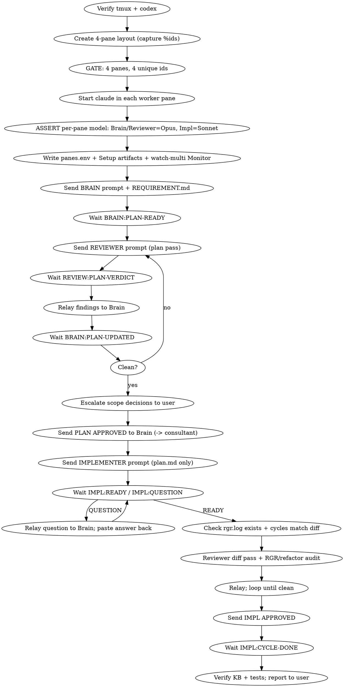

# tmux-worker-loop

## Overview

You orchestrate **three** Claude agents in sibling tmux panes while you stay in the driver pane.
Four roles, four panes:

| Role | Pane | Model | Writes | Never |
|---|---|---|---|---|
| **Main** | driver (you) | user's choice | relays, decisions | implements |
| **Brain** | worker 1 | **Opus** | `plan.md`, consult answers | production code |
| **Reviewer** | worker 2 | **Opus** | report files only | production code |
| **Implementer** | worker 3 | **Sonnet** | code + tests + KB + `rgr.log` | design decisions |

Four separate panes, always — never two roles sharing one session. A shared pane collapses the
context isolation that makes the Implementer's fresh read of `plan.md` meaningful, and makes the
Reviewer's audit of code it just watched being written worthless.

**Why the split.** A single agent that plans *and* implements carries author bias: it builds what
it meant rather than what the plan says, and its tests inherit the same blind spots. Handing
`plan.md` to a fresh Implementer forces the plan to prove it stands alone — if the Implementer has
to ask what a step means, that ambiguity would otherwise have shipped. The Brain stays alive as a
consultant so the reasoning is not lost, just quarantined.

The same argument runs one level down, inside the implementation: the Implementer works in strict
RED → GREEN → REFACTOR cycles, and the **Reviewer audits the refactors** — because an author
restructuring its own code cannot see when "cleanup" quietly changed behavior. See "RGR" below.

**Why Sonnet implements.** Execution against a precise plan is the cheapest phase to run and the
easiest to verify — tests are the oracle. Spending Opus there buys little; spend it on design and
adversarial review, where judgment is load-bearing. If the Implementer repeatedly asks questions a
careful reader would not need, that is a signal the *plan* is underspecified. Fix the plan, don't
upgrade the model.

Communication channels:
- `tmux send-keys` / `paste-buffer` — send prompts
- `tmux capture-pane` — read pane output
- Artifacts dir (`/tmp/tmux-worker-cycle-<id>/`) — `plan.md`, review reports, `sentinels.log`, watcher

One Monitor running `watch-multi.sh` covers all three panes: it reads the shared `sentinels.log`
with a single cursor (no duplicate events) and tracks busy→idle **per pane**, emitting `IDLE <role>`.

## When to use
- User says "send this requirement to the next pane and monitor it" or similar.
- Long-running coding task that benefits from adversarial review at plan + diff stages.
- User wants you to watch for drift, not implement directly.

## When NOT to use
- User wants you to implement the work yourself in this pane.
- No room for extra tmux panes and the user does not want them created.
- Work is small enough that orchestration overhead exceeds the value. Three agents plus a driver is
  a lot of machinery for a one-file change — in that case do it yourself rather than running a
  reduced topology. See "Topology is fixed at four panes".

## Workflow


```dot
digraph workflow {
  "Verify tmux + codex" -> "Create 4-pane layout (capture %ids)";
  "Create 4-pane layout (capture %ids)" -> "GATE: 4 panes, 4 unique ids";
  "GATE: 4 panes, 4 unique ids" -> "Start claude in each worker pane";
  "Start claude in each worker pane" -> "ASSERT per-pane model: Brain/Reviewer=Opus, Impl=Sonnet";
  "ASSERT per-pane model: Brain/Reviewer=Opus, Impl=Sonnet" -> "Write panes.env + Setup artifacts + watch-multi Monitor";
  "Write panes.env + Setup artifacts + watch-multi Monitor" -> "Send BRAIN prompt + REQUIREMENT.md";
  "Send BRAIN prompt + REQUIREMENT.md" -> "Wait BRAIN:PLAN-READY";

  "Wait BRAIN:PLAN-READY" -> "Send REVIEWER prompt (plan pass)";
  "Send REVIEWER prompt (plan pass)" -> "Wait REVIEW:PLAN-VERDICT";
  "Wait REVIEW:PLAN-VERDICT" -> "Relay findings to Brain";
  "Relay findings to Brain" -> "Wait BRAIN:PLAN-UPDATED";
  "Wait BRAIN:PLAN-UPDATED" -> "Clean?";
  "Clean?" -> "Send REVIEWER prompt (plan pass)" [label="no"];
  "Clean?" -> "Escalate scope decisions to user" [label="yes"];
  "Escalate scope decisions to user" -> "Send PLAN APPROVED to Brain (-> consultant)";

  "Send PLAN APPROVED to Brain (-> consultant)" -> "Send IMPLEMENTER prompt (plan.md only)";
  "Send IMPLEMENTER prompt (plan.md only)" -> "Wait IMPL:READY / IMPL:QUESTION";
  "Wait IMPL:READY / IMPL:QUESTION" -> "Relay question to Brain; paste answer back" [label="QUESTION"];
  "Relay question to Brain; paste answer back" -> "Wait IMPL:READY / IMPL:QUESTION";
  "Wait IMPL:READY / IMPL:QUESTION" -> "Check rgr.log exists + cycles match diff" [label="READY"];
  "Check rgr.log exists + cycles match diff" -> "Reviewer diff pass + RGR/refactor audit";
  "Reviewer diff pass + RGR/refactor audit" -> "Relay; loop until clean";
  "Relay; loop until clean" -> "Send IMPL APPROVED";
  "Send IMPL APPROVED" -> "Wait IMPL:CYCLE-DONE";
  "Wait IMPL:CYCLE-DONE" -> "Verify KB + tests; report to user";
}
```

## Step-by-step

### 0. Verify tmux + codex are installed
Run `command -v tmux` and the codex plugin/CLI checks. If anything is missing, **stop and read `references/install-setup.md`** for the install/verify flow before continuing. Do NOT proceed to step 1 with a degraded codex — the adversarial review gate is the whole point of this skill.

### 1. Build the 4-pane layout

> **⚡ Ronin Driver mode — skip this step.** If your prompt handed you four `%N` pane ids, the panes
> already exist and the 2×2 layout is Ronin's. **Do not split, kill, or re-layout anything** — the
> engine asserts the window has exactly 4 panes and will throw if you add one. Read
> `references/provisioned-panes.md` instead; it replaces Steps 0–2 and tells you how to write
> `panes.env` from the ids you were given. Everything from Step 3 on is identical.

**Documented path:** the driver Claude is already running inside tmux (`$TMUX` set). Create three
sibling panes and tile them. **Capture each pane's ID at the moment you create it** (`-P -F
'#{pane_id}'`) — a `%12`-style ID is bound to that pane for its whole life and survives every
later split and `select-layout`, so this is the only assignment that cannot go stale:

```bash
cwd=$(tmux display-message -p '#{pane_current_path}')
win=$(tmux display-message -p '#{session_name}:#{window_index}')
main=$(tmux display-message -p '#{pane_id}')          # driver = you

brain=$(tmux    split-window -h -c "$cwd" -t "$win" -P -F '#{pane_id}')
reviewer=$(tmux split-window -v -c "$cwd" -t "$win" -P -F '#{pane_id}')
impl=$(tmux     split-window -v -c "$cwd" -t "$brain" -P -F '#{pane_id}')
tmux select-layout -t "$win" tiled
tmux set-option -t "$win" mouse on
tmux set-option -t "$win" window-size latest
tmux set-option -t "$win" history-limit 50000

# Las tablas copy-mode son GLOBALES del servidor tmux, no de esta sesión: estos bindings también
# afectan las sesiones propias del operador. Se acepta para que arrastrar en ttyd copie al sistema.
clipboard_cmd=""
if [ "$(uname -s)" = "Darwin" ]; then
  clipboard_cmd="pbcopy"
elif command -v wl-copy >/dev/null 2>&1; then
  clipboard_cmd="wl-copy"
elif command -v xclip >/dev/null 2>&1; then
  clipboard_cmd="xclip -selection clipboard"
elif command -v xsel >/dev/null 2>&1; then
  clipboard_cmd="xsel --clipboard --input"
fi
if [ -n "$clipboard_cmd" ]; then
  tmux bind-key -T copy-mode MouseDragEnd1Pane send-keys -X copy-pipe-and-cancel "$clipboard_cmd"
  tmux bind-key -T copy-mode-vi MouseDragEnd1Pane send-keys -X copy-pipe-and-cancel "$clipboard_cmd"
fi

# HARD GATE: exactly 4 panes, 4 distinct ids, none empty.
n=$(tmux list-panes -t "$win" | wc -l | tr -d ' ')
ids=$(printf '%s\n' "$main" "$brain" "$reviewer" "$impl" | grep -c '^%')
uniq=$(printf '%s\n' "$main" "$brain" "$reviewer" "$impl" | sort -u | wc -l | tr -d ' ')
[ "$n" = 4 ] && [ "$ids" = 4 ] && [ "$uniq" = 4 ] \
  || { echo "LAYOUT FAIL: panes=$n ids=$ids uniq=$uniq"; }
echo "main=$main brain=$brain reviewer=$reviewer impl=$impl"
```

If the gate prints `LAYOUT FAIL`, **stop** — do not send prompts into a topology you cannot address.
Tear the extra panes down (`tmux kill-pane -t <id>`) and redo the block.

Label each pane so a human glancing at the window can tell who is who:

```bash
tmux select-pane -t "$main"     -T MAIN
tmux select-pane -t "$brain"    -T BRAIN
tmux select-pane -t "$reviewer" -T REVIEWER
tmux select-pane -t "$impl"     -T IMPLEMENTER
tmux set-option -t "$win" pane-border-status top
```

> **⚠️ tmux RENUMBERS panes on every split and on `select-layout`.** Pane *indices* are positional,
> not identities: a pane you called `0.1` before a split can be `0.2` after it, and if you keep
> talking to the stale index you will paste a prompt into an empty shell and silently stall the
> cycle. This is why the block above captures `#{pane_id}` (`%12`) at creation and **never** uses
> `session:window.index` afterwards. Every `send-keys`, `paste-buffer`, `capture-pane` and the
> watcher mapping take a `%id`.
>
> **Persist the mapping** the moment the layout is final, and re-read it instead of trusting memory
> or scrollback — a later `/clear` wipes the banner you would otherwise identify a pane by:
>
> ```bash
> cat > "$D/panes.env" <<EOF
> main=$main
> brain=$brain
> reviewer=$reviewer
> impl=$impl
> win=$win
> EOF
> . "$D/panes.env"     # re-source in any later step instead of re-deriving
> ```
>
> To confirm a `%id` is still alive: `tmux list-panes -a -F '#{pane_id}' | grep -qx "$impl"`.
> If it is gone, the pane was closed — do not re-derive by index, rebuild the layout.

If `$TMUX` is unset, tell the user to relaunch (`tmux new -s <name> && claude`) and re-issue.
**Fallback path** (detached session + new Terminal/iTerm window via osascript) is in
`references/pane-discovery.md`.

### 2. Start Claude in each worker pane, with the right model per role

Launch with an explicit `--model` — do not ride the account default, which may be a 1M-context tier
that costs more and may not even be entitled:

```bash
tmux send-keys -t "$brain"     "cd $cwd && claude --model opus"   Enter
tmux send-keys -t "$reviewer"  "cd $cwd && claude --model opus"   Enter
tmux send-keys -t "$impl"      "cd $cwd && claude --model sonnet" Enter
```

Then **assert the right model landed in the right pane.** A blanket
`grep -qE 'Opus|Sonnet|Haiku'` is not a check — it passes when the Implementer came up on Opus,
which is exactly the failure you are trying to catch (and the expensive one). Assert per pane, and
assert the *negative* too:

```bash
expect_model() {   # expect_model <pane-id> <role> <wanted-regex> <forbidden-regex>
  local t=$1 role=$2 want=$3 nope=$4 tries=0 snap
  while [ $tries -lt 45 ]; do
    snap=$(tmux capture-pane -t "$t" -p -S -50)
    if echo "$snap" | grep -qiE "$want"; then
      echo "$snap" | grep -qiE "$nope" \
        && { echo "MODEL FAIL [$role] $t: forbidden model in banner"; return 1; }
      echo "MODEL OK [$role] $t: $(echo "$snap" | grep -oiE "$want" | tail -1)"; return 0
    fi
    tries=$((tries+1)); sleep 2
  done
  echo "MODEL FAIL [$role] $t: no banner after 90s"; return 1
}

expect_model "$brain"    BRAIN       'opus'   'sonnet|haiku'
expect_model "$reviewer" REVIEWER    'opus'   'sonnet|haiku'
expect_model "$impl"     IMPLEMENTER 'sonnet' 'opus|haiku'
```

Any `MODEL FAIL` is a **hard stop**: kill that pane's Claude (`tmux send-keys -t <id> C-c`), relaunch
with the explicit `--model`, and re-assert. Never send a role prompt into an unverified pane —
a Reviewer silently running Sonnet degrades the one gate this whole topology exists to provide,
and nothing downstream will tell you it happened.

**Model per role, not per cycle:**

| Role | Model | Why |
|---|---|---|
| Brain | **Opus** | design judgment, KB reconciliation, premise-checking |
| Reviewer | **Opus** | adversarial reasoning is the one place you cannot afford to skimp |
| Implementer | **Sonnet** | executing a precise plan; tests are the oracle |

Verify the banner in each pane before sending prompts (`Opus 5 with high effort`,
`Sonnet 4.6`, …). Only reach for a 1M-context variant when the Brain genuinely must read a huge
codebase — and expect `API Error: Extra usage is required for 1M context` if the account lacks the
entitlement. On that error, park the cycle and tell the user; do NOT force it through.

The driver pane's model stays whatever the user picked — don't change it without asking.

### 2.5. Clear any pane that has prior conversation
A pane with a previous cycle's plan, review pastes, or diff in scrollback burns tokens every turn
and risks bleed-through. See `references/session-handling.md` for the decision tree
(fresh / mid-execution / idle-with-scrollback) and the `/clear` procedure. When in doubt, clear —
fresh context is cheap, a polluted one is not.

### 3. Set up artifacts and the multi-pane watcher

Cycle id = timestamp; dir = `/tmp/tmux-worker-cycle-<id>`. Copy **both** `watch-multi.sh` and
`relay.sh` into the dir (so each cycle is self-contained), write the requirement to
`REQUIREMENT.md`, `touch sentinels.log rgr.log`, write `panes.env` (step 1), then arm **one**
Monitor for all three panes:

```bash
D=/tmp/tmux-worker-cycle-$(date +%Y%m%d-%H%M%S); mkdir -p "$D"
S=~/.claude/skills/tmux-worker-loop
cp "$S/watch-multi.sh" "$S/relay.sh" "$D"/ && chmod +x "$D/watch-multi.sh" "$D/relay.sh"
touch "$D/sentinels.log" "$D/rgr.log"
```

The Monitor takes the same `%id`s you recorded in `panes.env` — never pane indices:

```
Monitor(
  command="CYCLE_DIR=/tmp/tmux-worker-cycle-<id> /tmp/tmux-worker-cycle-<id>/watch-multi.sh brain=<b> reviewer=<r> impl=<i>",
  description="Brain/Reviewer/Implementer sentinels + idle + limit alerts (<ticket>)",
  persistent=true,
  timeout_ms=3600000,
)
```

One watcher, not three: it reads the shared `sentinels.log` with a single cursor so each sentinel
fires **once**, tracks busy→idle per pane as `IDLE <role>`, and runs limit/traceback alerts on every
poll, ungated.

> **Re-arm the Monitor after any layout change.** If you add or remove a pane mid-cycle, indices
> shift (step 1) and the running watcher is now polling the wrong panes. `TaskStop` it and start a
> new one with the corrected mapping.

**Alert filtering (learned the hard way).** The role prompts contain the literal strings
"usage limit" and "approaching limit" in their self-throttle sections. A naive ungated grep matches
that echo in the scrollback and re-fires **every poll**, burying real events under a 5-second alarm
loop. `watch-multi.sh` v8 handles this two ways: it matches only plain-prose banner phrasings
(`you've hit your limit`, `usage limit will reset`, `Extra usage is required`, …) and drops any line
carrying markdown (backticks, `**`, `===`, list bullets), then de-dupes per role so an unchanged
banner fires once, not forever.

If you ever edit the alert regex, **smoke-test it before arming the Monitor** — run the watcher in
background for ~15s against live panes and confirm it emits nothing:

```bash
CYCLE_DIR=$D "$D/watch-multi.sh" brain=<b> reviewer=<r> impl=<i> > "$D/smoke.log" 2>&1 &
sleep 14; kill $!; cat "$D/smoke.log"   # empty (or only IDLE lines) = good
```

Still confirm any genuine-looking limit alert with one short `capture-pane` — filtering reduces
false positives, it does not eliminate them, and a real limit must never be dismissed.

### 4. Send the role prompts

> **Pre-dispatch budget gate.** Before sending, check the driver's session-usage indicator. See
> "Usage limits (HARD STOPS)" below. Refuse to dispatch a new cycle without headroom; refuse an
> autonomous multi-task batch at ≥ 50%.

Three templates, one per role. Render each with `sed`, substituting `<CYCLE_DIR>`, `<SERVICE>`,
`<WORKTREES>`, `<KB_PATH>`:

| Template | Pane | Sent when |
|---|---|---|
| `brain_prompt_template.md` | Brain | at cycle start |
| `reviewer_prompt_template.md` | Reviewer | at cycle start (it waits for your go) |
| `implementer_prompt_template.md` | Implementer | only after `PLAN APPROVED` |

**Isolate the work first.** Create a dedicated `git worktree` per repo off `origin/main` and name
them in `<WORKTREES>`. Never point workers at a shared checkout — it is usually dirty and on an
unrelated branch, and concurrent sessions will clobber each other.

Make sure `<KB_PATH>` exists; if not, fall back to `knowledge-base/README.md` + `architecture.md`.

**Send everything through `relay.sh`** — never hand-roll the paste:

```bash
CYCLE_DIR=$D "$D/relay.sh" brain -f "$D/brain_prompt.md"
CYCLE_DIR=$D "$D/relay.sh" impl -m "REVIEW: finding 3 is wrong — see plan.md §4."
```

It resolves the role to a `%id` via `panes.env`, refuses to paste into a pane that is mid-turn
(a paste landing mid-response arrives corrupted and the sentinel never fires), fails loudly with
`rc=3` if the pane was closed instead of pasting into the void, uses bracketed paste so multi-line
content survives Claude Code's input field, and appends every message to `<CYCLE_DIR>/relay.log`.

That transcript is the record of who told whom what — when a cycle goes wrong, it is usually the
first file to read.

### How the panes talk to each other

All four panes participate, but **every message is routed through Main**. This is deliberate, not a
limitation: Main is the drift check, and a Brain↔Implementer side-channel would let the plan get
renegotiated with no record and no one verifying the result still matches `REQUIREMENT.md`.

```
                REQUIREMENT.md
                      │
        ┌─────────────▼─────────────┐
        │           MAIN            │  driver — routes, decides scope, escalates to user
        └──┬──────────┬──────────┬──┘
           │          │          │
    plan ▲ │ ▼ approve│          │ ▼ prompt / REVIEW: findings
           │          │          │ ▲ IMPL:READY / QUESTION
      ┌────┴────┐     │     ┌────┴──────────┐
      │  BRAIN  │     │     │ IMPLEMENTER   │
      │  opus   │     │     │   sonnet      │
      └─────────┘     │     └───────────────┘
                 ┌────▼─────┐
                 │ REVIEWER │  opus — reads plan.md, the diff, and rgr.log
                 └──────────┘
```

The conversations that actually carry the work:

| # | Exchange | Route | Carries |
|---|---|---|---|
| 1 | Brain → Reviewer | `plan.md` + Main's go | plan pass |
| 2 | Reviewer → Brain | Main relays as `REVIEW:` | findings; loops until clean |
| 3 | Brain → Implementer | `plan.md` **only** | the contract — no design reasoning |
| 4 | Implementer → Brain | `IMPL:QUESTION` → Main → Brain → `BRAIN:ANSWER-READY` → Main → Impl | ambiguity in the plan |
| 5 | Implementer → Reviewer | the diff + `rgr.log` | diff pass + RGR audit |
| 6 | Reviewer → Implementer | Main relays as `REVIEW:` | findings; loops until clean |

Exchange 4 is the one people are tempted to shortcut. Don't: **every question the Implementer asks
is evidence the plan was underspecified**, and Main seeing it is how that gets fixed at the source
instead of being patched verbally. Log them.

Exchange 5 is where the RGR audit happens — the Reviewer reads `rgr.log` alongside the diff. See
"RGR: the loop the Implementer runs and the Reviewer audits" below.

### 5. The orchestration loop

> **Before each iteration, check your driver session usage.** At ≥ 99% jump to the Park procedure
> below — do NOT enter another phase. At ≥ 95%, finish the current phase and start no new one.

**Plan phase.** On `===BRAIN:PLAN-READY===`:
1. `Read` plan.md yourself. You are the last line of defense against drift; do not outsource
   comprehension.
2. Tell the Reviewer to run its **plan pass**. In parallel, dispatch 2-3 subagents with distinct
   lenses (requirement coverage / alternative approaches / risk & failure modes) — the Reviewer is
   one opinion, not an oracle.
3. **Independently verify the plan's load-bearing claims.** If the plan's central argument rests on
   "X already behaves like Y", read X yourself or send a verification subagent. A plan built on a
   misread citation is the most expensive failure mode in this workflow, and it is invisible to
   every downstream check.
4. Relay findings to the Brain prefixed `REVIEW:`. It updates and emits `===BRAIN:PLAN-UPDATED===`.
5. Loop until clean. **Escalate genuine scope decisions to the user** — do not let an agent quietly
   redefine what ships. Then send `PLAN APPROVED` (the Brain becomes a consultant).

**Implementation phase.** Send the Implementer prompt. On `===IMPL:QUESTION===`, relay to the Brain,
wait for `===BRAIN:ANSWER-READY===`, paste the answer back — and note the question, it is a defect
in the plan. On `===IMPL:READY===`:

1. **Check `<CYCLE_DIR>/rgr.log` exists** and its cycle count is plausible against `git diff --stat`.
   Missing or thin → send it back before spending the Reviewer on it.
2. Run the Reviewer's **diff pass**, which includes the mandatory RGR/refactor audit.
3. Run your own `git diff --stat` against the plan's promised file list.
4. Relay findings; loop until clean; then `IMPL APPROVED — proceed`.

**Codex, when available.** `codex:codex-rescue` is a valuable *second engine* at both gates — but it
is a thin forwarder that returns "task started" even when the job dies. Always verify via the job's
status/log file before treating its output as a gate decision. If codex is rate-limited, say so
plainly in your report: the cycle ran with single-engine review, which is a real reduction in
quality, not a footnote.

### 6. Final verification
After `===IMPL:CYCLE-DONE===`:
- Confirm the KB files actually mention the new flow (read them; don't trust the claim).
- Re-run the test suites yourself, or demand the exact pytest summary lines.
- Read `rgr.log` end to end and confirm the Reviewer's audit table covers every cycle in it.
  A cycle in the log with no verdict in the report was never reviewed.
- Report changed files, test results, RGR cycle count (and how many had a real refactor), deploy
  order, and any deferred follow-ups to the user.

## Sentinels (the contract)

**Mechanism (v7):** sentinels are detected from a FILE the worker appends to —
`<CYCLE_DIR>/sentinels.log` — NOT from scraping the pane. The pane scrape was the v6
failure mode: in a narrow (horizontally-split) pane the busy footer `esc to interrupt`
truncates to `esc to…` so the busy/idle grep never matched, the busy→idle transition
never fired again after the first poll, and WORKER-IDLE / SENTINEL / ALERT all went
silent (only the ungated `plan.md updated` mtime line kept firing). Long path-bearing
sentinels also wrap across lines that `capture-pane -J` cannot rejoin (Claude emits real
newlines at the wrap), so the anchored regex could never match them. The worker prompt
now instructs the worker to `printf '...' >> <CYCLE_DIR>/sentinels.log` at every phase
boundary in addition to printing it; `watch.sh` v7 tails that file, runs ALERT detection
on every poll (ungated), and uses a width-robust busy check (`esc to` prefix + `(Ns ·`
timer). **Ground truth if you ever suspect a missed event:** `cat <CYCLE_DIR>/sentinels.log`.

**v8 addition — ROLE PREFIXES.** With three panes writing to one log, every sentinel carries its
role so you can route without guessing which pane spoke:

| Role | Sentinels |
|---|---|
| Brain | `===BRAIN:PLAN-READY:<path>===` · `===BRAIN:PLAN-UPDATED:<path>===` · `===BRAIN:ANSWER-READY===` |
| Reviewer | `===REVIEW:PLAN-VERDICT:<path>===` · `===REVIEW:IMPL-VERDICT:<path>===` |
| Implementer | `===IMPL:QUESTION===` · `===IMPL:READY===` · `===IMPL:UPDATED===` · `===IMPL:CYCLE-DONE===` |
| Any | `===<ROLE>:PAUSED===` · `===<ROLE>:PARKED-LIMIT:<reset-time>===` |

Each agent emits **only** its own prefix. A `BRAIN:` sentinel appearing while the Brain is supposed
to be a consultant means it resumed writing — investigate before continuing.

The Reviewer writes its findings to a **file** and puts the path in the sentinel; it does not dump
reports into the pane, which would be unreadable and would trip the alert grep.

The worker appends each to `sentinels.log` AND prints it on its own line, only at phase boundaries.

## RGR: the loop the Implementer runs and the Reviewer audits

The Implementer works in strict **RED → GREEN → REFACTOR** cycles, one behavior per cycle, and
appends each cycle to `<CYCLE_DIR>/rgr.log`. The Reviewer audits that log against the diff during
its diff pass. Both halves are mandatory — the log without the audit is paperwork.

| Phase | Implementer must | Failure that hides here |
|---|---|---|
| 🔴 RED | write ONE failing test; read the failure; confirm it fails for the *intended* reason | `ImportError`/typo counted as "red" — the test never demonstrated the missing behavior |
| 🟢 GREEN | minimal code to pass; touch **no other test** | fixing the assertion instead of the code |
| 🔵 REFACTOR | restructure with **zero behavior change**; tests byte-identical | a behavior change relabeled as cleanup |

**Why the Reviewer owns the refactor audit.** The Implementer refactoring its own GREEN code is the
one place its author bias is unchecked: it knows what it *meant* the code to do, so when a
restructure quietly changes an edge case it experiences that as tidying, not as a change. It is the
last party who should certify its own refactors. The Reviewer has no such attachment — it only sees
what the code now does. This is the same argument that splits Brain from Implementer, applied one
level down.

As Main, your part is narrow but non-negotiable:
- **`rgr.log` must exist before you run the diff pass.** Missing, or fewer cycles than the diff
  implies → send it back; do not ask the Reviewer to audit a refactor with no record.
- **Skim it yourself** for `REFACTOR: NONE` on every cycle (phase performed as a formality) and for
  any `TESTS-TOUCHED-IN-REFACTOR` line that is not `none` (the invariant broke).
- **Never approve a "refactor" that required a test edit** without an explicit scope decision from
  the user. That is a behavior change wearing a refactor label, and it is exactly the drift this
  skill exists to catch.

## Detecting drift
Drift = the worker is implementing something that isn't in the requirement, or skipping a clause. Catch it by:
- Reading plan.md cover-to-cover before approving — look for items the requirement asked for but the plan omits.
- Asking codex specifically: "does this plan implement every clause in REQUIREMENT.md? List unaddressed clauses."
- After `IMPL-READY`, check `git diff --stat` against the plan's promised file list. Unexpected files = drift; missing files = drift.
- If drift found, paste a numbered list of clauses into the worker pane and tell it to address each one explicitly.

## Usage limits (HARD STOPS — both panes)

**Both the driver AND the worker MUST self-throttle. Either side blowing past the limit strands the orchestration.** This section overrides anything else in the skill — when in doubt, park.

### Pre-dispatch budget gate (do NOT skip)

**Before sending the worker prompt** (step 4 above), check the driver's session-usage indicator. The cycle ahead will spend tokens on subagents, codex reviews, plan/diff reads, and watcher events. Refuse to dispatch if the headroom is too small:

| Driver usage | Cycle scope | Action |
|---|---|---|
| ≥ 70% | Any new cycle | **STOP** — tell the user "Driver at X% — not enough headroom for a new cycle. Reset is at <time>. Want me to ScheduleWakeup until then?" Do not dispatch. |
| 50–69% | Autonomous batch (multi-task / "execute Tasks N–M autonomously") | **STOP** — autonomous batches have no per-task checkpoint. Refuse and offer single-cycle mode or wait for reset. |
| 50–69% | Single-cycle (one plan → one impl) | OK to dispatch, but warn the user once. |
| < 50% | Any | OK. |

This gate is the most important rule in this skill. The screenshot incident (driver dispatched at 93%, worker plowed Tasks 10–21 autonomously, both panes hit limit) happened because there was no pre-dispatch gate. Don't repeat it.

### Mandatory check before every expensive action (driver)

After dispatching, before EACH of the following, glance at the driver's usage indicator (status line / `/cost`):
- Dispatching a subagent (Agent tool, including parallel brainstorm fans)
- Calling `codex:codex-rescue` or any codex helper
- Reading large files or capturing big tmux scrollback (`-S` with a large window)
- Starting a new orchestration phase (PLAN-READY / IMPL-READY handling)
- Each iteration of the orchestration loop (step 5)

If usage ≥ 99%: **DO NOT** perform the action — go to **Park procedure** immediately.
If usage ≥ 95% but < 99%: finish current phase if possible, no new phase. Warn the user once.

### Worker self-throttle (worker enforces this on itself)

Each role prompt instructs that agent to check its own usage **between phases and between RGR
iterations** and emit `===<ROLE>:PARKED-LIMIT:<reset>===` if usage ≥ 95%. When the driver sees that
sentinel (or the watcher emits `ALERT [<role>] …`):

1. Do NOT relay anything into that pane.
2. Do NOT dispatch any subagents/codex/reads.
3. Tell the user in one line: "<Role> hit limit, resets at <time> — sleeping until then."
4. `ScheduleWakeup` until the reset time. That's it.

Note the roles hit limits **independently**. A parked Reviewer does not mean the Implementer must
stop mid-RGR-cycle — let it finish the current cycle and park at a clean boundary. But never run a
diff pass without the Reviewer: single-engine review is a real quality reduction, and if you skip
the gate you must say so plainly in your report rather than presenting the cycle as fully reviewed.

### Park procedure (driver hits 99% mid-cycle)

Park **all three** worker panes — a pane left running while the driver sleeps burns its own budget
and may finish into a void:

```bash
. "$D/panes.env"
for role in brain reviewer impl; do
  CYCLE_DIR=$D "$D/relay.sh" $role --raw-key Escape        # interrupt if mid-phase
  CYCLE_DIR=$D "$D/relay.sh" $role -m "PAUSE — driver at 99% session usage. Hold here, do not run tools or write files until I send RESUME. Reply only with your literal PAUSED sentinel."
done
```

Then wait for `===BRAIN:PAUSED===`, `===REVIEW:PAUSED===`, `===IMPL:PAUSED===` (read
`sentinels.log` once — do not poll panes), tell the user in one line that all three are parked, and
`ScheduleWakeup` until reset. Nothing else.

### Spending the last 1% (driver)

Forbidden: subagents, codex, large reads, large captures, plan/impl review, KB writes, drafting prose.
Allowed only: one `cat "$D/sentinels.log" | tail -5` per wake to confirm the panes are still parked,
plus `ScheduleWakeup`. Prefer the log over `capture-pane` — it is smaller and it is ground truth.

### When the watcher reports a limit alert

`watch-multi.sh` greps each pane's bottom 25 lines for plain-prose limit banners and emits
`ALERT [<role>] …`, de-duped per role. **The driver's response to any limit ALERT is hardcoded:**

- Do NOT respond to that pane.
- Do NOT continue the orchestration loop.
- Read the reset time from the alert text (e.g. "resets 12:30am").
- Compute `delaySeconds` from now to reset + 60s buffer.
- `ScheduleWakeup` once. Stop.

**Rule of thumb at 99% / on any limit alert: your job is to survive until reset, not to make progress.** Every token risks the driver dying before it can park the worker — leaving the user with a stuck pane when they come back.

## Troubleshooting
Quick reference table (capture, send, paste, idle/running detection) and common mistakes (sentinel scrollback matches, missing bracketed paste, blind plan approval, codex over-looping, requirement re-base) → `references/troubleshooting.md`.

## Files in this skill
- `SKILL.md` — this file (core flow)
- `watch-multi.sh` — **v8 multi-pane watcher**; copy into the cycle dir, one Monitor for all roles
- `relay.sh` — **inter-pane messaging**; resolves role→`%id`, blocks on busy panes, logs `relay.log`
- `brain_prompt_template.md` — Brain: plan + consultant, never writes code
- `reviewer_prompt_template.md` — Reviewer: adversarial passes + RGR/refactor audit, read-only
- `implementer_prompt_template.md` — Implementer: strict RED→GREEN→REFACTOR from `plan.md` alone
- `references/install-setup.md` — tmux + codex install/verify
- `references/pane-discovery.md` — full pane discovery + non-tmux fallback
- `references/provisioned-panes.md` — **Ronin Driver mode: the 4 panes already exist with fixed
  `%N` ids; replaces Steps 0–2.** Read it FIRST when the prompt hands you pane ids.
- `references/session-handling.md` — clear-between-cycles, 5-hour limit, 99% self-throttle
- `references/troubleshooting.md` — quick reference + common mistakes
- `watch.sh`, `worker_prompt_template.md` — **legacy** v7 single-worker mode. Superseded; the
  topology is no longer collapsible (see below). Kept only for reading old cycle dirs.

Files written per cycle into `<CYCLE_DIR>`: `REQUIREMENT.md`, `plan.md`, `panes.env`,
`sentinels.log`, `rgr.log`, `relay.log`, and the Reviewer's report files.

## Topology is fixed at four panes

**Always run the full four panes: Main, Brain, Reviewer, Implementer — four separate Claude
sessions, four separate contexts.** Do not collapse roles, do not run two roles in one pane, do not
skip the Reviewer because the change looks small. The layout gate in step 1 and the model
assertions in step 2 exist to make this checkable rather than assumed.

The reason is that every shortcut removes exactly the check that the remaining agents cannot
replace themselves:

| Shortcut | What it silently removes |
|---|---|
| Brain also implements | the plan never has to prove it stands alone; author bias returns |
| Implementer also reviews | nobody independent audits the refactors — the bias RGR exists to catch |
| Reviewer shares a pane | it "reviews" code it watched being written; not a fresh read |
| Skip Main, wire panes directly | no drift check against `REQUIREMENT.md`, no record |

If the work is genuinely too small to justify four agents, the answer is **not** a three-pane
variant — it is to do it yourself in this pane and skip the skill entirely. Orchestration overhead
is real; a one-file fix costs more to route than to make. That call belongs to the user: say what
you'd recommend and let them decide, rather than quietly collapsing the topology mid-cycle.

If the user explicitly asks to collapse for a specific cycle, that is their call — honor it, and
state in your report which gate ran degraded so the result is not read as fully reviewed.
