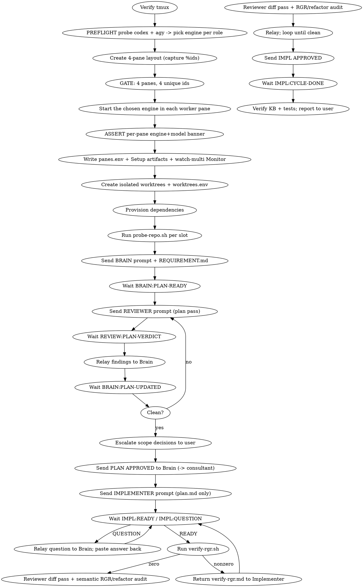

# tmux-worker-loop

## Overview

You orchestrate **three** coding agents in sibling tmux panes while you stay in the driver pane.
Four roles, four panes — and, as of v9, **three different CLIs**:

| Role | Pane | Engine | Fallback | Writes | Never |
|---|---|---|---|---|---|
| **Main** | driver (you) | `claude` **Opus 4.8** | — | relays, decisions | implements |
| **Brain** | worker 1 | `claude` **Opus 5** | — | `plan.md`, consult answers | production code |
| **Reviewer** | worker 2 | **`codex`** | `claude --model opus` | report files only | production code |
| **Implementer** | worker 3 | **`agy`** (Antigravity) | `claude --model sonnet` | code + tests + KB | design decisions; writing `rgr.log` by hand |

Four separate panes, always — never two roles sharing one session. A shared pane collapses the
context isolation that makes the Implementer's fresh read of `plan.md` meaningful, and makes the
Reviewer's audit of code it just watched being written worthless.

**Why a different engine reviews.** Two Claudes reviewing each other share a prior: the same
training, the same blind spots, the same taste in what "looks fine". Handing the adversarial pass
to codex buys a genuinely independent read for free — and the same logic makes agy a legitimate
Implementer, since executing a precise plan is verified by tests, not by pedigree.

**The fallbacks are load-bearing, not decorative.** codex and agy have their own quotas, separate
from Claude's, and they run out at their own pace. A rate-limited Reviewer is **not** a reason to
park the cycle — park is only for when *Claude* is out, because then there is nothing left to fall
back to. Swap the engine, re-assert the model, re-send the role prompt, and **write down in the
final report which engine actually did the work**: "reviewed by codex" and "reviewed by codex
until cycle 4, then Claude" are different claims about how well-reviewed the change is.

Per-engine launch flags, banner assertions, busy detection, preflight probes and the fallback
procedure all live in **`references/engines.md`** — read it before Step 0.

**Why the split.** A single agent that plans *and* implements carries author bias: it builds what
it meant rather than what the plan says, and its tests inherit the same blind spots. Handing
`plan.md` to a fresh Implementer forces the plan to prove it stands alone — if the Implementer has
to ask what a step means, that ambiguity would otherwise have shipped. The Brain stays alive as a
consultant so the reasoning is not lost, just quarantined.

The same argument runs one level down, inside the implementation: the Implementer works in strict
RED → GREEN → REFACTOR cycles, and the **Reviewer audits the refactors** — because an author
restructuring its own code cannot see when "cleanup" quietly changed behavior. See "RGR" below.

**Why the cheap tier implements.** Execution against a precise plan is the cheapest phase to run
and the easiest to verify — tests are the oracle. Spending frontier judgment there buys little;
spend it on design and adversarial review, where judgment is load-bearing. If the Implementer
repeatedly asks questions a careful reader would not need, that is a signal the *plan* is
underspecified. Fix the plan, don't upgrade the model.

**Why Main runs on the cheaper tier and the Reviewer never does.** Measured across 20 Main
sessions: Main is the role that exhausts its budget first (peak context 991 K vs the Reviewer's
516 K and the Brain's 388 K) because every artifact, test run and relay passes through it. But
Main's *job* — route messages, check the diff against the requirement, decide scope — does not
need frontier judgment; the Reviewer's does. So spend the cheap tier where the volume is and the
best available judgment where the thinking is.

**Never downgrade the Reviewer to buy headroom** — including its fallback. If codex is out, the
Reviewer falls back to `claude --model opus` at the **frontier** Opus tier (Opus 5), not 4.8: a
degraded reviewer is indistinguishable from a clean review, which is the one failure this topology
exists to prevent. The Reviewer is nowhere near its limit anyway, so there is nothing to buy.

⚠️ **A cheaper Main buys usage headroom, not context.** Context is consumed by what flows through
the conversation, and that is identical on any model — if Main is filling its window, the fix is
"Main's context economy" below, not a model swap.

Communication channels:
- `tmux send-keys` / `paste-buffer` — send prompts
- `tmux capture-pane` — read pane output
- Artifacts dir (`/tmp/tmux-worker-cycle-<id>/`) — `plan.md`, review reports, `sentinels.log`, watcher

Label worker-created containers with `--label cowork.session=<session>` (or name them `<session>-…`) so Ronin removes them when the session is closed.

One Monitor running `watch-multi.sh` covers all three panes: it reads the shared `sentinels.log`
with a single cursor (no duplicate events) and tracks busy→idle **per pane**, emitting `IDLE <role>`.

## When to use
- User says "send this requirement to the next pane and monitor it" or similar.
- Long-running coding task that benefits from adversarial review at plan + diff stages.
- User wants you to watch for drift, not implement directly.

## When NOT to use
- User wants you to implement the work yourself in this pane.
- No room for extra tmux panes and the user does not want them created.
- Work is small enough that orchestration overhead exceeds the value. Three agents plus a driver is
  a lot of machinery for a one-file change — in that case do it yourself rather than running a
  reduced topology. See "Topology is fixed at four panes".

## Workflow


```dot
digraph workflow {
  "Verify tmux" -> "PREFLIGHT probe codex + agy -> pick engine per role";
  "PREFLIGHT probe codex + agy -> pick engine per role" -> "Create 4-pane layout (capture %ids)";
  "Create 4-pane layout (capture %ids)" -> "GATE: 4 panes, 4 unique ids";
  "GATE: 4 panes, 4 unique ids" -> "Start the chosen engine in each worker pane";
  "Start the chosen engine in each worker pane" -> "ASSERT per-pane engine+model banner";
  "ASSERT per-pane engine+model banner" -> "Write panes.env + Setup artifacts + watch-multi Monitor";
  "Write panes.env + Setup artifacts + watch-multi Monitor" -> "Create isolated worktrees + worktrees.env";
  "Create isolated worktrees + worktrees.env" -> "Provision dependencies";
  "Provision dependencies" -> "Run probe-repo.sh per slot";
  "Run probe-repo.sh per slot" -> "Send BRAIN prompt + REQUIREMENT.md";
  "Send BRAIN prompt + REQUIREMENT.md" -> "Wait BRAIN:PLAN-READY";

  "Wait BRAIN:PLAN-READY" -> "Send REVIEWER prompt (plan pass)";
  "Send REVIEWER prompt (plan pass)" -> "Wait REVIEW:PLAN-VERDICT";
  "Wait REVIEW:PLAN-VERDICT" -> "Relay findings to Brain";
  "Relay findings to Brain" -> "Wait BRAIN:PLAN-UPDATED";
  "Wait BRAIN:PLAN-UPDATED" -> "Clean?";
  "Clean?" -> "Send REVIEWER prompt (plan pass)" [label="no"];
  "Clean?" -> "Escalate scope decisions to user" [label="yes"];
  "Escalate scope decisions to user" -> "Send PLAN APPROVED to Brain (-> consultant)";

  "Send PLAN APPROVED to Brain (-> consultant)" -> "Send IMPLEMENTER prompt (plan.md only)";
  "Send IMPLEMENTER prompt (plan.md only)" -> "Wait IMPL:READY / IMPL:QUESTION";
  "Wait IMPL:READY / IMPL:QUESTION" -> "Relay question to Brain; paste answer back" [label="QUESTION"];
  "Relay question to Brain; paste answer back" -> "Wait IMPL:READY / IMPL:QUESTION";
  "Wait IMPL:READY / IMPL:QUESTION" -> "Run verify-rgr.sh" [label="READY"];
  "Run verify-rgr.sh" -> "Return verify-rgr.md to Implementer" [label="nonzero"];
  "Return verify-rgr.md to Implementer" -> "Wait IMPL:READY / IMPL:QUESTION";
  "Run verify-rgr.sh" -> "Reviewer diff pass + semantic RGR/refactor audit" [label="zero"];
  "Reviewer diff pass + RGR/refactor audit" -> "Relay; loop until clean";
  "Relay; loop until clean" -> "Send IMPL APPROVED";
  "Send IMPL APPROVED" -> "Wait IMPL:CYCLE-DONE";
  "Wait IMPL:CYCLE-DONE" -> "Verify KB + tests; report to user";
}
```

## Step-by-step

### 0. Verify tmux, then preflight the engines

`command -v tmux` first — no tmux, no panes. If it is missing, **stop and read
`references/install-setup.md`**.

Then **probe codex and agy before you build anything**, because the answer decides what you launch
in two of the three panes. Each probe is one cheap non-interactive turn and it distinguishes "not
installed", "broken auth" and "no quota left" in a single exit code:

```bash
D=/tmp/tmux-worker-cycle-$(date +%Y%m%d-%H%M%S); mkdir -p "$D"

reviewer_engine=claude
command -v codex >/dev/null 2>&1 \
  && codex exec --sandbox read-only --skip-git-repo-check -m gpt-5.4-mini \
       'Reply with exactly: READY' >"$D/preflight-codex.log" 2>&1 \
  && grep -q READY "$D/preflight-codex.log" && reviewer_engine=codex

impl_engine=claude
command -v agy >/dev/null 2>&1 \
  && agy -p 'Reply with exactly: READY' --model gemini-3.6-flash-low \
       >"$D/preflight-agy.log" 2>&1 \
  && grep -q READY "$D/preflight-agy.log" && impl_engine=agy

echo "reviewer_engine=$reviewer_engine impl_engine=$impl_engine"
```

Do the probe **now**, not lazily at the first review gate. Discovering codex is out *after* you
have pasted a 2,000-line plan into its pane costs the paste, the wait, and a confused diagnosis.

**Then say one line to the user naming the engines the cycle will run on.** A cycle reviewed by a
fallback Claude instead of codex is a materially different cycle; the user should not have to read
`panes.env` to learn that. Do not stop for approval — the fallback is the designed behavior, not
an exception — but do not let it pass silently either.

Missing entirely (`command -v` fails) is an install question, not a fallback question: mention it
once so the user can fix it, then proceed on Claude. Install flow for both CLIs is in
`references/install-setup.md`.

**Read `references/engines.md` before Step 2.** It carries the launch flags, the per-engine banner
assertions, the busy/idle predicate, and the mid-cycle fallback procedure — none of which are the
same across the three CLIs.

### 1. Build the 4-pane layout

> **⚡ Ronin Driver mode — skip this step.** If your prompt handed you four `%N` pane ids, the panes
> already exist and the 2×2 layout is Ronin's. **Do not split, kill, or re-layout anything** — the
> engine asserts the window has exactly 4 panes and will throw if you add one. Read
> `references/provisioned-panes.md` instead; it replaces Steps 0–2 and tells you how to write
> `panes.env` from the ids you were given. Everything from Step 3 on is identical.

**Documented path:** the driver Claude is already running inside tmux (`$TMUX` set). Create three
sibling panes and tile them. **Capture each pane's ID at the moment you create it** (`-P -F
'#{pane_id}'`) — a `%12`-style ID is bound to that pane for its whole life and survives every
later split and `select-layout`, so this is the only assignment that cannot go stale:

```bash
cwd=$(tmux display-message -p '#{pane_current_path}')
win=$(tmux display-message -p '#{session_name}:#{window_index}')
main=$(tmux display-message -p '#{pane_id}')          # driver = you

tmux set-option -g history-limit 50000
brain=$(tmux    split-window -h -c "$cwd" -t "$win" -P -F '#{pane_id}')
reviewer=$(tmux split-window -v -c "$cwd" -t "$win" -P -F '#{pane_id}')
impl=$(tmux     split-window -v -c "$cwd" -t "$brain" -P -F '#{pane_id}')
tmux select-layout -t "$win" tiled
tmux set-option -t "$win" mouse on
tmux set-option -t "$win" window-size latest

# Las tablas root/copy-mode son GLOBALES del servidor tmux, no de esta sesión: estos bindings
# también afectan las sesiones propias del operador. El bind por defecto reenvía el arrastre a la
# app en cuanto ésta pide el ratón (Claude/Codex lo hacen) y copiar deja de ser posible; sin el
# término mouse_any_flag el arrastre siempre selecciona. Un modificador no sirve de escape:
# xterm.js/ttyd entrega el evento a tmux SIN el modificador.
tmux bind-key -T root MouseDrag1Pane if-shell -F '#{pane_in_mode}' 'send-keys -M' 'copy-mode -M'
clipboard_cmd=""
if [ "$(uname -s)" = "Darwin" ]; then
  clipboard_cmd="pbcopy"
elif command -v wl-copy >/dev/null 2>&1; then
  clipboard_cmd="wl-copy"
elif command -v xclip >/dev/null 2>&1; then
  clipboard_cmd="xclip -selection clipboard"
elif command -v xsel >/dev/null 2>&1; then
  clipboard_cmd="xsel --clipboard --input"
fi
if [ -n "$clipboard_cmd" ]; then
  tmux bind-key -T copy-mode MouseDragEnd1Pane send-keys -X copy-pipe-and-cancel "$clipboard_cmd"
  tmux bind-key -T copy-mode-vi MouseDragEnd1Pane send-keys -X copy-pipe-and-cancel "$clipboard_cmd"
fi
echo "main=$main brain=$brain reviewer=$reviewer impl=$impl"
/bin/bash "$D/gate-layout.sh" "$win" "$main" "$brain" "$reviewer" "$impl"
```

Run that block as one Bash invocation and decide from `$?`. If it returns nonzero, **stop** — do not
send prompts into a topology you cannot address.
Tear the extra panes down (`tmux kill-pane -t <id>`) and redo the block.

Label each pane so a human glancing at the window can tell who is who:

```bash
tmux select-pane -t "$main"     -T MAIN
tmux select-pane -t "$brain"    -T BRAIN
tmux select-pane -t "$reviewer" -T REVIEWER
tmux select-pane -t "$impl"     -T IMPLEMENTER
tmux set-option -t "$win" pane-border-status top
```

> **⚠️ tmux RENUMBERS panes on every split and on `select-layout`.** Pane *indices* are positional,
> not identities: a pane you called `0.1` before a split can be `0.2` after it, and if you keep
> talking to the stale index you will paste a prompt into an empty shell and silently stall the
> cycle. This is why the block above captures `#{pane_id}` (`%12`) at creation and **never** uses
> `session:window.index` afterwards. Every `send-keys`, `paste-buffer`, `capture-pane` and the
> watcher mapping take a `%id`.
>
> **Persist the mapping** the moment the layout is final, and re-read it instead of trusting memory
> or scrollback — a later `/clear` wipes the banner you would otherwise identify a pane by:
>
> ```bash
> cat > "$D/panes.env" <<EOF
> main=$main
> brain=$brain
> reviewer=$reviewer
> impl=$impl
> win=$win
> EOF
> . "$D/panes.env"     # re-source in any later step instead of re-deriving
> ```
>
> To confirm a `%id` is still alive: `tmux list-panes -a -F '#{pane_id}' | grep -qx "$impl"`.
> If it is gone, the pane was closed — do not re-derive by index, rebuild the layout.

If `$TMUX` is unset, tell the user to relaunch (`tmux new -s <name> && claude`) and re-issue.
**Fallback path** (detached session + new Terminal/iTerm window via osascript) is in
`references/pane-discovery.md`.

### 2. Start the chosen engine in each worker pane

Launch each pane with the engine the preflight picked and an **explicit model** — never ride an
account default, which may be a tier that costs more, or one you are not even entitled to. `$D` is
the cycle dir; `$WT` the worktree. RGR refs live in the Git common directory, which is outside a
linked worktree, so grant that physical path separately:

```bash
GIT_COMMON_DIR=$(git -C "$WT" rev-parse --path-format=absolute --git-common-dir) || exit 1

tmux send-keys -t "$brain" "cd $cwd && claude --model opus" Enter

# Reviewer — codex, else the Claude fallback
[ "$reviewer_engine" = codex ] \
  && tmux send-keys -t "$reviewer" "cd $cwd && codex --sandbox workspace-write --add-dir $D --add-dir $WT --add-dir $GIT_COMMON_DIR -a never -c model_reasoning_effort=high" Enter \
  || tmux send-keys -t "$reviewer" "cd $cwd && claude --model opus" Enter

# Implementer — agy, else the Claude fallback
[ "$impl_engine" = agy ] \
  && tmux send-keys -t "$impl" "cd $cwd && agy --model gemini-3.6-flash-high --add-dir $D --add-dir $WT --add-dir $GIT_COMMON_DIR --dangerously-skip-permissions" Enter \
  || tmux send-keys -t "$impl" "cd $cwd && claude --model sonnet" Enter
```

**Pre-trust the worktree for BOTH codex and agy before you launch** (snippets in `engines.md`). This
is not an edge case — the cycle creates a fresh `git worktree`, so the path is always new and
therefore always untrusted, and **both** CLIs open on a *"Do you trust the contents of this …?"*
menu in an untrusted directory. Every paste then lands in the menu instead of the prompt.

**The flags are not optional garnish either** — `engines.md` has the flag-by-flag table. Without
`--add-dir $D`, every sentinel append is refused. Without `--add-dir $GIT_COMMON_DIR`, ordinary
worktree edits succeed but `rgr.sh` cannot create the shared evidence refs. Either omission stalls
the cycle at a phase boundary with the pane looking like it is thinking.

⚠️ **A pane blocked on a menu reads as *busy*, not stuck.** agy renders `esc to cancel` in its
footer while a permission menu is up, so the busy predicate says "working" and every observer
agrees. Measured: `relay.sh` waited out its full 240 s timeout and the old watcher emitted nothing
at all for the whole hang. `watch-multi.sh` v9 now alerts on the menus themselves —
`ALERT [<role>] BLOCKED on a permission/trust menu` — and that alert means hands-on now, not
patience.

Then **assert the right engine and model landed in the right pane.** A blanket
`grep -qE 'Opus|Sonnet|Haiku'` was never a real check, and across three CLIs it is not even
well-defined. Each engine prints its own banner; assert that one, and assert the *negative* too:

| Engine | Assert | Forbid |
|---|---|---|
| claude | `opus` (Brain) / `sonnet` (Impl) | the other tiers |
| codex | `model: *gpt-[0-9.]+ *(high\|medium\|low)` | `not supported when using Codex`, `Do you trust the contents of` |
| agy | `Antigravity CLI [0-9]` | `is no longer available. Using`, `Do you trust the contents of` |

`expect_engine`, the shared helper, is in `references/engines.md` — along with why the version digit
in the agy pattern is load-bearing (`Antigravity CLI` alone also matches the trust menu's own text,
so the bare pattern reports OK for a pane stuck on a menu) and which pattern to use when you
re-assert a pane that has already been working (the banner scrolls away; match the footer).

⚠️ **The agy negative assertion is the one that will actually fire.** `agy models` prints the whole
catalogue, not your entitlement, and asking for a model you cannot run does **not** fail — agy warns
and silently runs something else:

```
⚠ Warning
  ⎿  "gemini-3.1-pro-high" is no longer available. Using "Gemini 3.6 Flash (High)".
```

That is a hard FAIL, identical in kind to a Reviewer coming up on the wrong tier: the cycle would
run on a model nobody chose and nothing downstream would ever mention it.

Any FAIL is a **hard stop**: kill that pane's CLI (`C-c` twice), relaunch with the explicit model,
and re-assert. Never send a role prompt into an unverified pane — a degraded Reviewer removes the
one gate this whole topology exists to provide, and it fails silently.

**Model per role, not per cycle:**

| Role | Engine · model | Why |
|---|---|---|
| Main | claude **Opus 4.8** | highest volume, lowest judgment requirement — spend the cheap tier here |
| Brain | claude **Opus 5** | design judgment, KB reconciliation, premise-checking |
| Reviewer | **codex**, high effort | adversarial reasoning, from outside Claude's blind spots |
| Implementer | **agy** (top available tier) | executing a precise plan; tests are the oracle |

Only reach for a 1M-context Claude variant when the Brain genuinely must read a huge codebase — and
expect `API Error: Extra usage is required for 1M context` if the account lacks the entitlement. On
that error, park the cycle and tell the user; do NOT force it through.

**The driver pane defaults to Opus 4.8.** If it is on something else, say so once and offer to
switch (`/model`) — but never switch without asking, and never downgrade the Reviewer to save
budget. If codex is unavailable the Reviewer falls back to Opus 5, not to something cheaper.

### 2.6. Main's context economy (the reason Main hits the wall first)

Measured on a real cycle, Main's context was 377 KB of tool results — **54 % of it `Read`**, almost
all of it reading `plan.md` and review reports **in full**. Three rules cut that by roughly 40 %
without losing a single check:

1. **Read verdicts, not reports.** Brain and Reviewer must open their artifacts with a `## VERDICT`
   block (verdict line + blockers, ≤30 lines). Main reads **only that**:
   ```bash
   sed -n '1,60p' "$D/review-plan-1.md"
   ```
   Open the full file **only** when the verdict is not clean, and then jump to the named findings
   rather than reading cover-to-cover. *(This does not weaken "read plan.md yourself" in the plan
   phase — the plan is the contract and Main still reads it once, in full.)*
2. **Never let a test run dump into context.** Redirect, then print only what you reason about:
   ```bash
   cmd=$(awk -F= -v key=TEST_CMD_1 '$1 == key {sub(/^[^=]*=/, ""); print}' "$D/harness.$slot.env")
   (cd "$worktree" && sh -c "$cmd") > /tmp/run.txt 2>&1
   tail -2 /tmp/run.txt
   sed -n '/^## GATE/,$p' "$D/verify-rgr.md"   # only the verified summary reaches you
   ```
   A 45-failure list pasted twice is 20 KB that told you nothing a `comm` line wouldn't.
3. **Relay pointers, not quotes.** `"lee $D/review-plan-1.md y aplica F1-F14"` costs ~200 bytes;
   pasting the findings costs 4 KB **and** duplicates text the pane can read itself. Quote only the
   handful of findings you independently verified, plus your own decisions.

The same discipline applies to `capture-pane`: prefer `cat "$D/sentinels.log"` (ground truth,
small) over scraping scrollback.

### 2.5. Clear any pane that has prior conversation
A pane with a previous cycle's plan, review pastes, or diff in scrollback burns tokens every turn
and risks bleed-through. See `references/session-handling.md` for the decision tree
(fresh / mid-execution / idle-with-scrollback). When in doubt, clear — fresh context is cheap, a
polluted one is not.

`/clear` is **Claude-only**. For a codex or agy pane the reset is to kill the CLI and relaunch it
(`C-c` twice, then the launch command) — verified on both. Do not type `/clear` into them; it is
not their slash command and it lands as a literal prompt.

### 3. Set up artifacts and the multi-pane watcher

Cycle id = timestamp; dir = `/tmp/tmux-worker-cycle-<id>`. Copy the transport scripts and the
complete harness into the dir (so each cycle is self-contained), write the requirement to
`REQUIREMENT.md`, `touch sentinels.log rgr.log`, write `panes.env` (step 1), then arm **one**
Monitor for all three panes:

```bash
# $D already exists — Step 0 created it for the preflight logs.
S="${TMUX_WORKER_SKILL_SRC:-$HOME/.claude/skills/tmux-worker-loop}"
cp "$S/watch-multi.sh" "$S/relay.sh" "$D"/ && chmod +x "$D/watch-multi.sh" "$D/relay.sh"
cp -R "$S/harness" "$D"/ && chmod +x "$D"/harness/*.sh
skill_source=$(cd "$S" && pwd -P)
skill_head=$(git -C "$skill_source" rev-parse HEAD)
rgr_sha=$(git -C "$skill_source" hash-object "$skill_source/harness/rgr.sh")
printf '%s\n' \
  "source=$skill_source" \
  "head=$skill_head" \
  "rgr-sha=$rgr_sha" \
  > "$D/harness.provenance"
touch "$D/sentinels.log" "$D/rgr.log"
```

**`panes.env` records the engines too**, not just the pane ids — the watcher's alert patterns and
your own fallback decisions key on them, and after a mid-cycle swap this file is the only place the
truth is written down:

```bash
cat >> "$D/panes.env" <<EOF
brain_engine=claude
reviewer_engine=$reviewer_engine
impl_engine=$impl_engine
EOF
```

The Monitor takes the same `%id`s you recorded in `panes.env` — never pane indices:

```
Monitor(
  command="CYCLE_DIR=/tmp/tmux-worker-cycle-<id> /tmp/tmux-worker-cycle-<id>/watch-multi.sh brain=<b> reviewer=<r> impl=<i>",
  description="Brain/Reviewer/Implementer sentinels + idle + limit alerts (<ticket>)",
  persistent=true,
  timeout_ms=3600000,
)
```

One watcher, not three: it reads the shared `sentinels.log` with a single cursor so each sentinel
fires **once**, tracks busy→idle per pane as `IDLE <role>`, and runs limit/traceback alerts on every
poll, ungated.

**v9 is engine-aware in two places.** Its limit regex now carries codex's and agy's phrasings
alongside Claude's, so a rate-limited Reviewer surfaces as an `ALERT` instead of as a pane that
mysteriously stops answering. And its busy check no longer trusts the footer alone: claude and agy
pin `esc to …` at the bottom of the pane, but **codex prints its working indicator inline in the
transcript**, so it scrolls out of view the moment output streams — measured over a 16-second codex
turn, the footer grep matched on the first poll and returned nothing on every poll after it while
text was still streaming. v9 adds a change-detector (pane differs from last poll ⇒ busy) that covers
the gap. `relay.sh` carries the same predicate, which is what stops it pasting into a codex pane
mid-answer. Details in `references/engines.md`.

> **Re-arm the Monitor after any layout change.** If you add or remove a pane mid-cycle, indices
> shift (step 1) and the running watcher is now polling the wrong panes. `TaskStop` it and start a
> new one with the corrected mapping.

**Alert filtering (learned the hard way).** The role prompts contain the literal strings
"usage limit" and "approaching limit" in their self-throttle sections. A naive ungated grep matches
that echo in the scrollback and re-fires **every poll**, burying real events under a 5-second alarm
loop. `watch-multi.sh` handles this two ways: it matches only plain-prose banner phrasings
(`you've hit your limit`, `usage limit will reset`, `Extra usage is required`, …) and drops any line
carrying markdown (backticks, `**`, `===`, list bullets), then de-dupes per role so an unchanged
banner fires once, not forever.

If you ever edit the alert regex, **smoke-test it before arming the Monitor** — run the watcher in
background for ~15s against live panes and confirm it emits nothing:

```bash
CYCLE_DIR=$D "$D/watch-multi.sh" brain=<b> reviewer=<r> impl=<i> > "$D/smoke.log" 2>&1 &
sleep 14; kill $!; cat "$D/smoke.log"   # empty (or only IDLE lines) = good
```

Still confirm any genuine-looking limit alert with one short `capture-pane` — filtering reduces
false positives, it does not eliminate them, and a real limit must never be dismissed.

### 4. Send the role prompts

> **Pre-dispatch budget gate.** Before sending, check the driver's session-usage indicator. See
> "Usage limits (HARD STOPS)" below. Refuse to dispatch a new cycle without headroom; refuse an
> autonomous multi-task batch at ≥ 50%.

Before rendering any prompt, prepare every repository in this order:

1. Create a dedicated `git worktree` per repository off the approved base and give each one a
   stable slot name. Never point workers at a shared checkout.
2. Write `worktrees.env` as `slot=/physical/path` entries, resolving every path with `pwd -P`.
   Reject duplicate slots and duplicate physical paths.
3. Provision dependencies before probing. For Node, a main-checkout `node_modules` symlink is
   allowed only when the two `package-lock.json` files are byte-identical; otherwise install in the
   worktree using Main's network access. The worker sandboxes have no network.
4. Probe every declared slot and capture its executable contract. Conceptually this is
   `probe-repo.sh "$slot"`; invoke the cycle-local copy as shown:

   ```bash
   while IFS='=' read -r slot worktree; do
     [ -n "$slot" ] || continue
     CYCLE_DIR="$D" "$D/harness/probe-repo.sh" "$slot" || exit $?
   done < "$D/worktrees.env"
   ```

Render each template only after those steps, substituting `<CYCLE_DIR>`, `<SERVICE>`, `<WORKTREES>`,
`<KB_PATH>`, and the values from each `harness.<slot>.env`:

| Template | Pane | Sent when |
|---|---|---|
| `brain_prompt_template.md` | Brain | at cycle start |
| `reviewer_prompt_template.md` | Reviewer | at cycle start (it waits for your go) |
| `implementer_prompt_template.md` | Implementer | only after `PLAN APPROVED` |

**The templates are engine-neutral — send them verbatim to codex and agy too.** They are written in
terms of "run a shell command" and "read the file", not Claude tool names, and the sentinel contract
is a shell append that all three CLIs can perform (verified end to end on codex: pasted instruction →
`printf … >> sentinels.log` → line in the file, no approval stall). Do not write a reduced
"codex version" of the reviewer prompt: the severity ladder and the mandatory RGR audit are the
review, and a paraphrase drops them.

Make sure `<KB_PATH>` exists; if not, fall back to `knowledge-base/README.md` + `architecture.md`.

**Send everything through `relay.sh`** — never hand-roll the paste:

```bash
CYCLE_DIR=$D "$D/relay.sh" brain -f "$D/brain_prompt.md"
CYCLE_DIR=$D "$D/relay.sh" impl -m "REVIEW: finding 3 is wrong — see plan.md §4."
```

It resolves the role to a `%id` via `panes.env`, refuses to paste into a pane that is mid-turn
(a paste landing mid-response arrives corrupted and the sentinel never fires), fails loudly with
`rc=3` if the pane was closed instead of pasting into the void, uses bracketed paste so multi-line
content survives Claude Code's input field, and appends every message to `<CYCLE_DIR>/relay.log`.

That transcript is the record of who told whom what — when a cycle goes wrong, it is usually the
first file to read.

### How the panes talk to each other

All four panes participate, but **every message is routed through Main**. This is deliberate, not a
limitation: Main is the drift check, and a Brain↔Implementer side-channel would let the plan get
renegotiated with no record and no one verifying the result still matches `REQUIREMENT.md`.

```
                REQUIREMENT.md
                      │
        ┌─────────────▼─────────────┐
        │           MAIN            │  driver — routes, decides scope, escalates to user
        └──┬──────────┬──────────┬──┘
           │          │          │
    plan ▲ │ ▼ approve│          │ ▼ prompt / REVIEW: findings
           │          │          │ ▲ IMPL:READY / QUESTION
      ┌────┴────┐     │     ┌────┴──────────┐
      │  BRAIN  │     │     │ IMPLEMENTER   │
      │ claude  │     │     │     agy       │
      └─────────┘     │     └───────────────┘
                 ┌────▼─────┐
                 │ REVIEWER │  codex — reads plan.md, the diff, rgr.log, and verify-rgr.md
                 └──────────┘
```

The conversations that actually carry the work:

| # | Exchange | Route | Carries |
|---|---|---|---|
| 1 | Brain → Reviewer | `plan.md` + Main's go | plan pass |
| 2 | Reviewer → Brain | Main relays as `REVIEW:` | findings; loops until clean |
| 3 | Brain → Implementer | `plan.md` **only** | the contract — no design reasoning |
| 4 | Implementer → Brain | `IMPL:QUESTION` → Main → Brain → `BRAIN:ANSWER-READY` → Main → Impl | ambiguity in the plan |
| 5 | Implementer → Reviewer | the diff + `rgr.log` + `verify-rgr.md` | diff pass + semantic RGR audit |
| 6 | Reviewer → Implementer | Main relays as `REVIEW:` | findings; loops until clean |

Exchange 4 is the one people are tempted to shortcut. Don't: **every question the Implementer asks
is evidence the plan was underspecified**, and Main seeing it is how that gets fixed at the source
instead of being patched verbally. Log them.

Exchange 5 is where the semantic RGR audit happens — the Reviewer reads the gate report alongside the diff. See
"RGR: the loop the Implementer runs and the Reviewer audits" below.

### 5. The orchestration loop

> **Before each iteration, check your driver session usage.** At ≥ 99% jump to the Park procedure
> below — do NOT enter another phase. At ≥ 95%, finish the current phase and start no new one.

**Plan phase.** On `===BRAIN:PLAN-READY===`:
1. `Read` plan.md yourself, **in full, once**. You are the last line of defense against drift; do
   not outsource comprehension. On every *later* `PLAN-UPDATED`, read only the `## TL;DR` block and
   the sections its changelog says moved — re-reading 1,000+ lines per revision is what exhausts
   the driver (see §2.6).
2. Tell the Reviewer to run its **plan pass**. In parallel, dispatch 2-3 subagents with distinct
   lenses (requirement coverage / alternative approaches / risk & failure modes) — the Reviewer is
   one opinion, not an oracle.
3. **Independently verify the plan's load-bearing claims.** If the plan's central argument rests on
   "X already behaves like Y", read X yourself or send a verification subagent. A plan built on a
   misread citation is the most expensive failure mode in this workflow, and it is invisible to
   every downstream check.
4. On `===REVIEW:PLAN-VERDICT===`, read the report's **`## VERDICT` block first**
   (`sed -n '1,60p'`). Open the body only for findings that are blockers, that you intend to
   push back on, or that you are about to verify yourself.
5. Relay findings to the Brain prefixed `REVIEW:`. **Point at the report file**; quote only the
   findings you personally verified and your own decisions — the Brain can read the rest itself.
   It updates and emits `===BRAIN:PLAN-UPDATED===`.
6. Loop until clean. **Escalate genuine scope decisions to the user** — do not let an agent quietly
   redefine what ships. Then send `PLAN APPROVED` (the Brain becomes a consultant).

**Implementation phase.** Send the Implementer prompt. On `===IMPL:QUESTION===`, relay to the Brain,
wait for `===BRAIN:ANSWER-READY===`, paste the answer back — and note the question, it is a defect
in the plan. On `===IMPL:READY===`:

1. Run the machine gate before spending the Reviewer on semantic work:
   ```bash
   CYCLE_DIR="$D" "$D/harness/verify-rgr.sh"
   ```
   If it exits nonzero, do not dispatch review. Return the Implementer to `verify-rgr.md` and wait
   for a new READY. Main declares every approved exception only through argv as
   `--<type> <subject> [--scope key=value]... --reason "<why>"`; all must appear
   together under `DECLARED EXCEPTIONS` in that report, never inside `rgr.log`.
2. Run the Reviewer's **diff pass**, which consumes `verify-rgr.md` and includes the mandatory
   semantic RGR/refactor audit.
3. Run your own `git diff --stat` against the plan's promised file list.
4. **Run the declared `$TEST_CMD_*` suites yourself, but never into your context** — redirect their
   raw output and compare the result with the anchored baseline and counts in `verify-rgr.md`.
5. Read the diff report's `## VERDICT` block first; open the body for blockers only.
6. Relay findings; loop until clean; then `IMPL APPROVED — proceed`.

**Engine trouble at either gate.** The Reviewer pane *is* codex now, so a codex rate limit no longer
degrades the review to "skipped" — it degrades it to Claude. Swap the engine per
`references/engines.md`, re-assert the banner, re-send the reviewer prompt, and record the swap.
Same for agy on the Implementer side, with one extra cost: a mid-RGR swap loses every cycle of
context, so the replacement must be handed `plan.md`, `rgr.log`, `harness.<slot>.env`, and `git diff` explicitly and told
which cycle it is resuming at, or it will re-implement work already sitting in the diff.

If you also reach for `codex:codex-rescue` from your own context as an extra opinion, remember it is
a thin forwarder that returns "task started" even when the job dies — verify via the job's
status/log file before treating its output as a gate decision.

### 6. Final verification
After `===IMPL:CYCLE-DONE===`:
- Confirm the KB files actually mention the new flow (read them; don't trust the claim).
- Re-run every `$TEST_CMD_*` declared in each `harness.<slot>.env`; report the format each stack
  actually emits rather than assuming pytest.
- Read `DEPS_OK` and `MISSING` from every slot contract. Missing affordances are declared limits,
  not silently successful checks.
- Run `verify-rgr.sh` one final time and confirm its `## GATE` result before reporting success.
- Read `rgr.log` end to end and confirm the Reviewer's audit table covers every cycle in it.
  A cycle in the log with no verdict in the report was never reviewed.
- Report changed files, test results, RGR cycle count (and how many had a real refactor), deploy
  order, and any deferred follow-ups to the user.
- **State which engine did each job**, including any mid-cycle fallback and the cycle it happened
  at. "Reviewed by codex" and "reviewed by codex through cycle 4, then Claude" are different claims
  about how independently the change was checked; the user cannot infer which one is true.
- Warn if the installed skill and repository copy differ: merging does not install the skill.
- After every verification and report is complete, remove the cycle evidence namespace explicitly:
  ```bash
  git for-each-ref --format='delete %(refname)' "refs/rgr/<cycle-id>" | git update-ref --stdin
  ```

## Steering loop

Every problem observed twice becomes a named control. Record the incident, whether the response is
guidance or a machine sensor, and where that response now lives. Prefer a sensor when the property is
computable; when it is not, keep the limitation explicit and assign the semantic check to a role.
This is how footer truncation became file sentinels, alert false positives gained filtering and
dedupe, and the 93% usage incident became a pre-dispatch budget gate. Do not leave repeated failures
as oral history.

## Sentinels (the contract)

**Mechanism (v7):** sentinels are detected from a FILE the worker appends to —
`<CYCLE_DIR>/sentinels.log` — NOT from scraping the pane. The pane scrape was the v6
failure mode: in a narrow (horizontally-split) pane the busy footer `esc to interrupt`
truncates to `esc to…` so the busy/idle grep never matched, the busy→idle transition
never fired again after the first poll, and WORKER-IDLE / SENTINEL / ALERT all went
silent (only the ungated `plan.md updated` mtime line kept firing). Long path-bearing
sentinels also wrap across lines that `capture-pane -J` cannot rejoin (Claude emits real
newlines at the wrap), so the anchored regex could never match them. The worker prompt
now instructs the worker to `printf '...' >> <CYCLE_DIR>/sentinels.log` at every phase
boundary in addition to printing it; `watch.sh` v7 tails that file, runs ALERT detection
on every poll (ungated), and uses a width-robust busy check (`esc to` prefix + `(Ns ·`
timer). **Ground truth if you ever suspect a missed event:** `cat <CYCLE_DIR>/sentinels.log`.

**v8 addition — ROLE PREFIXES.** With three panes writing to one log, every sentinel carries its
role so you can route without guessing which pane spoke:

| Role | Sentinels |
|---|---|
| Brain | `===BRAIN:PLAN-READY:<path>===` · `===BRAIN:PLAN-UPDATED:<path>===` · `===BRAIN:ANSWER-READY===` |
| Reviewer | `===REVIEW:PLAN-VERDICT:<path>===` · `===REVIEW:IMPL-VERDICT:<path>===` |
| Implementer | `===IMPL:QUESTION===` · `===IMPL:READY===` · `===IMPL:UPDATED===` · `===IMPL:CYCLE-DONE===` |
| Any | `===<ROLE>:PAUSED===` · `===<ROLE>:PARKED-LIMIT:<reset-time>===` |

Each agent emits **only** its own prefix. A `BRAIN:` sentinel appearing while the Brain is supposed
to be a consultant means it resumed writing — investigate before continuing.

The Reviewer writes its findings to a **file** and puts the path in the sentinel; it does not dump
reports into the pane, which would be unreadable and would trip the alert grep.

The worker appends each to `sentinels.log` AND prints it on its own line, only at phase boundaries.

## RGR: the loop the Implementer runs and the Reviewer audits

The Implementer works in strict **RED → GREEN → REFACTOR** cycles, one behavior per cycle.
`rgr.sh` executes every phase, anchors its evidence under `refs/rgr/<cycle-id>/…`, and is the sole
writer of `<CYCLE_DIR>/rgr.log`. Main runs `verify-rgr.sh`; the Reviewer then audits the remaining
semantic questions against the diff and `verify-rgr.md`.

| Phase | Implementer must | Failure that hides here |
|---|---|---|
| 🔴 RED | write ONE failing test; read the failure; confirm it fails for the *intended* reason | `ImportError`/typo counted as "red" — the test never demonstrated the missing behavior |
| 🟢 GREEN | minimal code to pass; touch **no other test** | fixing the assertion instead of the code |
| 🔵 REFACTOR | restructure with **zero behavior change**; tests byte-identical | a behavior change relabeled as cleanup |

**Why the Reviewer owns the refactor audit.** The Implementer refactoring its own GREEN code is the
one place its author bias is unchecked: it knows what it *meant* the code to do, so when a
restructure quietly changes an edge case it experiences that as tidying, not as a change. It is the
last party who should certify its own refactors. The Reviewer has no such attachment — it only sees
what the code now does. This is the same argument that splits Brain from Implementer, applied one
level down.

As Main, your part is narrow but non-negotiable:
- **The gate must exit zero before you run the diff pass.** Its cycle count, phase order, test diffs,
  scalar totals, failure sets and object ownership are established evidence.
- **Read `verify-rgr.md` as a coverage boundary, not a blanket certificate.** It declares the
  mechanical `covered=` dimensions, the `not-covered=` dimensions, every historical evidence
  frontier, and every Main-declared exception or debt. `RESULT: PASS` establishes only `covered=`;
  the Reviewer must independently audit every `not-covered=` item, plus `catches=n/a`, repeated
  `REFACTOR note=NONE`, warnings, frontiers, and exceptions.
- **Never approve a "refactor" that required a test edit** without an explicit scope decision from
  the user. That is a behavior change wearing a refactor label, and it is exactly the drift this
  skill exists to catch.

The refs are probative, not temporary decoration: they keep each tree, raw run and normalized
failure-set blob reachable through `git gc`, while an unreferenced object can be pruned. Delete the
namespace only after final verification as shown above.

Two accepted limits remain visible. The emission of voluntary sentinels is not mechanically forced.
"Never push" has no sensor because Git hooks are shared across worktrees; Main must verify that rule.

## Detecting drift
Drift = the worker is implementing something that isn't in the requirement, or skipping a clause. Catch it by:
- Reading plan.md cover-to-cover before approving — look for items the requirement asked for but the plan omits.
- Asking codex specifically: "does this plan implement every clause in REQUIREMENT.md? List unaddressed clauses."
- After `IMPL-READY`, check `git diff --stat` against the plan's promised file list. Unexpected files = drift; missing files = drift.
- If drift found, paste a numbered list of clauses into the worker pane and tell it to address each one explicitly.

## Usage limits (HARD STOPS — both panes)

**Both the driver AND the worker MUST self-throttle. Either side blowing past the limit strands the orchestration.** This section overrides anything else in the skill — when in doubt, park.

### Park vs. fall back — decide by engine, not by symptom

The rules below were written when every pane was Claude and a limit meant "everyone waits". With
three engines on three separate quotas, that is no longer the right default:

| Who hit the limit | Action |
|---|---|
| **Reviewer on codex** | **Fall back**, don't park: swap to `claude --model opus`, re-assert, re-send the reviewer prompt, record the swap in the report. |
| **Implementer on agy** | **Fall back** to `claude --model sonnet` — but only at a clean RGR boundary, and hand the replacement `plan.md` + `rgr.log` + `git diff` and the cycle number it resumes at. |
| **Any pane already on the Claude fallback** | **Park.** There is nothing left to swap to. |
| **Brain, or Main (the driver)** | **Park.** Both are Claude-only by design. |

Falling back is not free — it costs a re-prompt and, for the Implementer, a context handoff — but
it costs far less than parking a whole cycle until a reset. Park is the last resort, not the first
response. The full procedure is in `references/engines.md`; the Park procedure below is unchanged
for the cases that genuinely need it.

### Pre-dispatch budget gate (do NOT skip)

**Before sending the worker prompt** (step 4 above), check the driver's session-usage indicator. The cycle ahead will spend tokens on subagents, codex reviews, plan/diff reads, and watcher events. Refuse to dispatch if the headroom is too small:

| Driver usage | Cycle scope | Action |
|---|---|---|
| ≥ 70% | Any new cycle | **STOP** — tell the user "Driver at X% — not enough headroom for a new cycle. Reset is at <time>. Want me to ScheduleWakeup until then?" Do not dispatch. |
| 50–69% | Autonomous batch (multi-task / "execute Tasks N–M autonomously") | **STOP** — autonomous batches have no per-task checkpoint. Refuse and offer single-cycle mode or wait for reset. |
| 50–69% | Single-cycle (one plan → one impl) | OK to dispatch, but warn the user once. |
| < 50% | Any | OK. |

This gate is the most important rule in this skill. The screenshot incident (driver dispatched at 93%, worker plowed Tasks 10–21 autonomously, both panes hit limit) happened because there was no pre-dispatch gate. Don't repeat it.

### Mandatory check before every expensive action (driver)

After dispatching, before EACH of the following, glance at the driver's usage indicator (status line / `/cost`):
- Dispatching a subagent (Agent tool, including parallel brainstorm fans)
- Calling `codex:codex-rescue` or any codex helper
- Reading large files or capturing big tmux scrollback (`-S` with a large window)
- Starting a new orchestration phase (PLAN-READY / IMPL-READY handling)
- Each iteration of the orchestration loop (step 5)

If usage ≥ 99%: **DO NOT** perform the action — go to **Park procedure** immediately.
If usage ≥ 95% but < 99%: finish current phase if possible, no new phase. Warn the user once.

### Worker self-throttle (worker enforces this on itself)

Each role prompt instructs that agent to check its own usage **between phases and between RGR
iterations** and emit `===<ROLE>:PARKED-LIMIT:<reset>===` when it is out. When the driver sees that
sentinel (or the watcher emits `ALERT [<role>] …`), first ask which engine that pane is running
(`panes.env`) and apply the table above. If the answer is **fall back**, do that — do not sleep. If
the answer is **park**:

1. Do NOT relay anything into that pane.
2. Do NOT dispatch any subagents/codex/reads.
3. Tell the user in one line: "<Role> hit limit, resets at <time> — sleeping until then."
4. `ScheduleWakeup` until the reset time. That's it.

⚠️ **codex and agy do not expose a percentage the way Claude does.** Their role prompts cannot
"check usage ≥ 95%" — they park on the first hard limit/quota error instead, which means a codex or
agy pane parks *at* the wall rather than before it. Budget for that: it is one more reason a
fallback beats a park for those two panes.

Note the roles hit limits **independently**, and now on independent quotas. A parked Reviewer does
not mean the Implementer must stop mid-RGR-cycle — let it finish the current cycle and park at a
clean boundary. But never run a diff pass without the Reviewer: no review is a real quality
reduction, and if you skip the gate you must say so plainly in your report rather than presenting
the cycle as fully reviewed.

### Park procedure (driver hits 99% mid-cycle)

Park **all three** worker panes — a pane left running while the driver sleeps burns its own budget
and may finish into a void:

```bash
. "$D/panes.env"
for role in brain reviewer impl; do
  CYCLE_DIR=$D "$D/relay.sh" $role --raw-key Escape        # interrupt if mid-phase
  CYCLE_DIR=$D "$D/relay.sh" $role -m "PAUSE — driver at 99% session usage. Hold here, do not run tools or write files until I send RESUME. Reply only with your literal PAUSED sentinel."
done
```

Then wait for `===BRAIN:PAUSED===`, `===REVIEW:PAUSED===`, `===IMPL:PAUSED===` (read
`sentinels.log` once — do not poll panes), tell the user in one line that all three are parked, and
`ScheduleWakeup` until reset. Nothing else.

### Spending the last 1% (driver)

Forbidden: subagents, codex, large reads, large captures, plan/impl review, KB writes, drafting prose.
Allowed only: one `cat "$D/sentinels.log" | tail -5` per wake to confirm the panes are still parked,
plus `ScheduleWakeup`. Prefer the log over `capture-pane` — it is smaller and it is ground truth.

### When the watcher reports a limit alert

`watch-multi.sh` greps each pane's bottom 25 lines for plain-prose limit banners and emits
`ALERT [<role>] …`, de-duped per role. **The driver's response to any limit ALERT is hardcoded:**

- Do NOT respond to that pane.
- Do NOT continue the orchestration loop.
- Read the reset time from the alert text (e.g. "resets 12:30am").
- Compute `delaySeconds` from now to reset + 60s buffer.
- `ScheduleWakeup` once. Stop.

**Rule of thumb at 99% / on any limit alert: your job is to survive until reset, not to make progress.** Every token risks the driver dying before it can park the worker — leaving the user with a stuck pane when they come back.

## Troubleshooting
Quick reference table (capture, send, paste, idle/running detection) and common mistakes (sentinel scrollback matches, missing bracketed paste, blind plan approval, codex over-looping, requirement re-base) → `references/troubleshooting.md`.

## Files in this skill
- `SKILL.md` — this file (core flow)
- `references/engines.md` — **the three-CLI contract**: preflight probes, launch flags, per-engine
  banner assertions, the busy/idle predicate, limit strings, and the mid-cycle fallback procedure.
  Read it before Step 2.
- `watch-multi.sh` — **v9 multi-pane, multi-engine watcher**; copy into the cycle dir, one Monitor
  for all roles
- `relay.sh` — **inter-pane messaging**; resolves role→`%id`, blocks on busy panes (engine-portable
  check), logs `relay.log`
- `harness/` — computational RGR tooling:
  - `rgr.sh` — sole phase runner and writer of `rgr.log`
  - `verify-rgr.sh` — Main's machine gate over anchored RGR evidence
  - `probe-repo.sh` — discovers and records each slot's executable repository contract
  - `fitness.sh` — dispatches repository-specific fitness rules
  - `gate-layout.sh` — enforces the four-pane topology by exit code
  - `rgr-log.sh` — sourced library; sole owner of the frozen log constructor and parser
  - `fixture-runner.mjs` — execution-only fixture plumbing outside `TEST_GLOBS`; it contains no assertions
  - `harness.test.mjs` — fixture suite for the scripts and operational markdown contracts
- `brain_prompt_template.md` — Brain: plan + consultant, never writes code
- `reviewer_prompt_template.md` — Reviewer: adversarial passes + RGR/refactor audit, read-only
- `implementer_prompt_template.md` — Implementer: strict RED→GREEN→REFACTOR from `plan.md` alone
- `references/install-setup.md` — tmux + codex + agy install/verify
- `references/pane-discovery.md` — full pane discovery + non-tmux fallback
- `references/provisioned-panes.md` — **Ronin Driver mode: the 4 panes already exist with fixed
  `%N` ids; replaces Steps 0–2.** Read it FIRST when the prompt hands you pane ids.
- `references/session-handling.md` — clear-between-cycles, 5-hour limit, 99% self-throttle
- `references/troubleshooting.md` — quick reference + common mistakes
- `watch.sh`, `worker_prompt_template.md` — **legacy** v7 single-worker mode. Superseded; the
  topology is no longer collapsible (see below). Kept only for reading old cycle dirs.

Files written per cycle into `<CYCLE_DIR>`: `REQUIREMENT.md`, `plan.md`, `panes.env`,
`worktrees.env`, `harness.<slot>.env`, `harness.provenance`, `.rgr-index`, `sentinels.log`, `rgr.log`,
`verify-rgr.md`, `relay.log`, and the Reviewer's report files.

## Topology is fixed at four panes

**Always run the full four panes: Main, Brain, Reviewer, Implementer — four separate CLI sessions,
four separate contexts.** Do not collapse roles, do not run two roles in one pane, do not skip the
Reviewer because the change looks small. The layout gate in step 1 and the engine assertions in
step 2 exist to make this checkable rather than assumed.

Which *engine* fills a pane is negotiable (that is what the fallbacks are for). Whether the pane
exists is not.

The reason is that every shortcut removes exactly the check that the remaining agents cannot
replace themselves:

| Shortcut | What it silently removes |
|---|---|
| Brain also implements | the plan never has to prove it stands alone; author bias returns |
| Implementer also reviews | nobody independent audits the refactors — the bias RGR exists to catch |
| Reviewer shares a pane | it "reviews" code it watched being written; not a fresh read |
| Skip Main, wire panes directly | no drift check against `REQUIREMENT.md`, no record |

If the work is genuinely too small to justify four agents, the answer is **not** a three-pane
variant — it is to do it yourself in this pane and skip the skill entirely. Orchestration overhead
is real; a one-file fix costs more to route than to make. That call belongs to the user: say what
you'd recommend and let them decide, rather than quietly collapsing the topology mid-cycle.

If the user explicitly asks to collapse for a specific cycle, that is their call — honor it, and
state in your report which gate ran degraded so the result is not read as fully reviewed.
